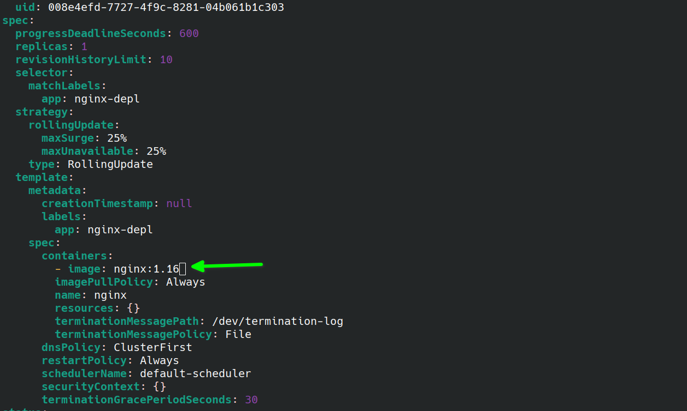
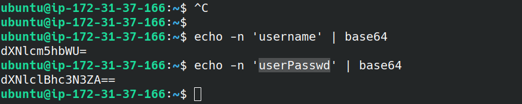
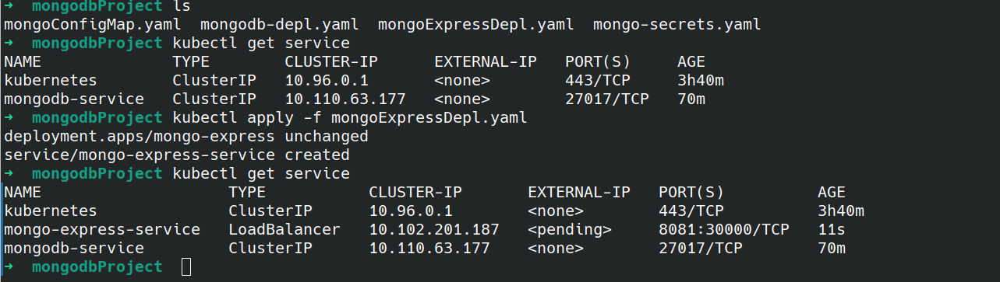

[see practicals](#practicals)

online play ground for kubernetes: https://labs.play-with-k8s.com/

**Microservices** can be deployed individually on separate servers provisioned with fewer resources - only what is required by each service and the host system itself, helping to lower compute resource expenses.

Microservices-based architecture is aligned with Event-driven Architecture and Service-Oriented Architecture (SOA) principles, where complex applications are composed of small independent processes which communicate with each other through Application Programming Interfaces (APIs) over a network. APIs allow access by other internal services of the same application or external, third-party services and applications.

Each microservice is developed and written in a modern programming language, selected to be the best suitable for the type of service and its business function. This offers a great deal of flexibility when matching microservices with specific hardware when required, allowing deployments on inexpensive commodity hardware.

Although the distributed nature of microservices adds complexity to the architecture, one of the greatest benefits of microservices is scalability. With the overall application becoming modular, each microservice can be scaled individually, either manually or automated through demand-based autoscaling.

Seamless upgrades and patching processes are other benefits of microservices architecture. There is virtually no downtime and no service disruption to clients because upgrades are rolled out seamlessly - one service at a time, rather than having to recompile, rebuild and restart an entire monolithic application. As a result, businesses are able to develop and roll-out new features and updates a lot faster, in an agile approach, having separate teams focusing on separate features, thus being more productive and cost-effective.

A detailed list of success stories is available at the Kubernetes website: Kubernetes User Case Studies.

- **AppDirect** - an end-to-end commerce platform provider, started from a complex monolith application and through refactoring was able to retain limited functionality monoliths receiving very few commits, but all new features implemented as containerized microservices.
- **box** - a cloud storage solutions provider, started from a complex monolith architecture and through refactoring was able to decompose it into microservices.
- **Crowdfire** - a content management solutions provider, successfully broke down their initial monolith into microservices.
- **GolfNow** - a technology and services provider, decided to break their monoliths apart into containerized microservices.
- **Pinterest** - a social media services provider, started the refactoring process by first migrating their monolith API.
***
**Containers** are an application-centric method to deliver high-performing, scalable applications on any infrastructure of your choice. Containers are best suited to deliver microservices by providing portable, isolated virtual environments for applications to run without interference from other running applications.


img: container Deployment

**Microservices** are lightweight applications written in various modern programming languages, with specific dependencies, libraries and environmental requirements. To ensure that an application has everything it needs to run successfully it is packaged together with its dependencies.

Containers encapsulate microservices and their dependencies but do not run them directly. Containers run container images.

A **container image** bundles the application along with its runtime, libraries, and dependencies, and it represents the source of a container deployed to offer an isolated executable environment for the application. Containers can be deployed from a specific image on many platforms, such as workstations, Virtual Machines, public cloud, etc

In Development (Dev) environments, running containers on a single host for development and testing of applications may be a suitable option. However, when migrating to Quality Assurance (QA) and Production (Prod) environments, that is no longer a viable option because the applications and services need to meet specific requirements:

- Fault-tolerance
- On-demand scalability
- Optimal resource usage
- Auto-discovery to automatically discover and communicate with each other
- Accessibility from the outside world
- Seamless updates/rollbacks without any downtime.

**Container** orchestrators are tools which group systems together to form clusters where containers' deployment and management is automated at scale while meeting the requirements mentioned above. The clustered systems confer the advantages of distributed systems, such as increased performance, cost efficiency, reliability, workload distribution, and reduced latency.


### Why Use Container Orchestrators?
Although we can manually maintain a couple of containers or write scripts to manage the lifecycle of dozens of containers, orchestrators make things much easier for users especially when it comes to managing hundreds or thousands of containers running on a global infrastructure.

Most container orchestrators can:

- Group hosts together while creating a cluster, in order to leverage the benefits of dictributed systems.
Schedule containers to run on hosts in the cluster based on resources availability.
- Enable containers in a cluster to communicate with each other regardless of the host they are deployed to in the cluster.
- Bind containers and storage resources.
- Group sets of similar containers and bind them to load-balancing constructs to simplify access to containerized applications by creating an interface, a level of abstraction between the containers and the client.
Manage and optimize resource usage.
- Allow for implementation of policies to secure access to applications running inside containers.

With all these configurable yet flexible features, container orchestrators are an obvious choice when it comes to managing containerized applications at scale. In this course, we will explore **Kubernetes**, one of the most in-demand container orchestration tools available today.

### Where to Deploy Container Orchestrators?
Most container orchestrators can be deployed on the infrastructure of our choice - on bare metal, Virtual Machines, on-premises, on public and hybrid clouds. Kubernetes, for example, can be deployed on a workstation, with or without an isolation layer such as a local hypervisor or container runtime, inside a company's data center, in the cloud on AWS Elastic Compute Cloud (EC2) instances, Google Compute Engine (GCE) VMs, DigitalOcean Droplets, IBM Virtual Servers, OpenStack, etc.

In addition, there are turnkey cloud solutions which allow production Kubernetes clusters to be installed, with only a few commands, on top of cloud Infrastructures-as-a-Service. These solutions paved the way for the managed container orchestration as-a-Service, more specifically the managed Kubernetes as-a-Service (KaaS) solution, offered and hosted by the major cloud providers. Examples of KaaS solutions are Amazon Elastic Kubernetes Service (Amazon EKS), Azure Kubernetes Service (AKS), DigitalOcean Kubernetes, Google Kubernetes Engine (GKE), IBM Cloud Kubernetes Service, Oracle Container Engine for Kubernetes, or VMware Tanzu Kubernetes Grid.

## By the end of this chapter, you should be able to:

- Define Kubernetes.
- Explain the reasons for using Kubernetes.
- Discuss the features of Kubernetes.
- Discuss the evolution of Kubernetes from Borg. [skipped]
- Explain the role of the Cloud Native Computing Foundation.[skipped]

### What Is Kubernetes?

According to the Kubernetes website,

"Kubernetes is an open-source system for automating deployment, scaling, and management of containerized applications".


Kubernetes is also referred to as k8s (pronounced Kate's), as there are 8 characters between k and s.

### Kubernetes Features

Kubernetes offers a very rich set of features for container orchestration. Some of its fully supported features are:

- **Automatic bin packing**

&nbsp;&nbsp;&nbsp;&nbsp;&nbsp;&nbsp;&nbsp;&nbsp;Kubernetes automatically schedules containers based on resource needs and constraints, to maximize utilization without sacrificing availability.

- **Designed for extensibility**

&nbsp;&nbsp;&nbsp;&nbsp;&nbsp;&nbsp;&nbsp;&nbsp;A Kubernetes cluster can be extended with new custom features without modifying the upstream source code.

- **Self-healing**

&nbsp;&nbsp;&nbsp;&nbsp;&nbsp;&nbsp;&nbsp;&nbsp;Kubernetes automatically replaces and reschedules containers from failed nodes. It terminates and then restarts containers that become unresponsive to health checks, based on existing rules/policy. It also prevents traffic from being routed to unresponsive containers.

- **Horizontal scaling**

&nbsp;&nbsp;&nbsp;&nbsp;&nbsp;&nbsp;&nbsp;&nbsp;Kubernetes scales applications manually or automatically based on CPU or custom metrics utilization.

- **Service discovery and load balancing**

&nbsp;&nbsp;&nbsp;&nbsp;&nbsp;&nbsp;&nbsp;&nbsp;Containers receive IP addresses from Kubernetes, while it assigns a single Domain Name System (DNS) name to a set of containers to aid in load-balancing requests across the containers of the set.

Additional fully supported Kubernetes features are:

- **Automated rollouts and rollbacks**

&nbsp;&nbsp;&nbsp;&nbsp;&nbsp;&nbsp;&nbsp;&nbsp;Kubernetes seamlessly rolls out and rolls back application updates and configuration changes, constantly monitoring the application's health to prevent any downtime.

- **Secret and configuration management**

&nbsp;&nbsp;&nbsp;&nbsp;&nbsp;&nbsp;&nbsp;&nbsp;Kubernetes manages sensitive data and configuration details for an application separately from the container image, in order to avoid a rebuild of the respective image. Secrets consist of sensitive/confidential information passed to the application without revealing the sensitive content to the stack configuration, like on GitHub.

- **Storage orchestration**

&nbsp;&nbsp;&nbsp;&nbsp;&nbsp;&nbsp;&nbsp;&nbsp;Kubernetes automatically mounts software-defined storage (SDS) solutions to containers from local storage, external cloud providers, distributed storage, or network storage systems.

- **Batch execution**

&nbsp;&nbsp;&nbsp;&nbsp;&nbsp;&nbsp;&nbsp;&nbsp;Kubernetes supports batch execution, long-running jobs, and replaces failed containers.

- **IPv4/IPv6 dual-stack**

&nbsp;&nbsp;&nbsp;&nbsp;&nbsp;&nbsp;&nbsp;&nbsp;Kubernetes supports both IPv4 and IPv6 addresses.

Kubernetes supports common Platform as a Service specific features such as application deployment, scaling, and load balancing, but allows users to integrate their desired monitoring, logging and alerting solutions through optional plugins.

There are many additional features currently in alpha or beta phase. They will add great value to any Kubernetes deployment once they become stable features. For example, support for role-based access control (RBAC) is stable only as of the Kubernetes 1.8 release, while cronjob support is stable only as of release 1.21.

### Why Use Kubernetes?

Another one of Kubernetes' strengths is portability. It can be deployed in many environments such as local or remote Virtual Machines, bare metal, or in public/private/hybrid/multi-cloud setups.

Kubernetes extensibility allows it to support and to be supported by many 3rd party open source tools which enhance Kubernetes' capabilities and provide a feature-rich experience to its users. It's architecture is modular and pluggable. Not only does it orchestrate modular, decoupled microservices type applications, but also its architecture follows decoupled microservices patterns. Kubernetes' functionality can be extended by writing custom resources, operators, custom APIs, scheduling rules or plugins.

For a successful open source project, the community is as important as having great code. Kubernetes is supported by a thriving community across the world. It has more than 3,500 contributors, who, over time, have pushed over 120,000 commits. There are meet-up groups in different cities and countries which meet regularly to discuss Kubernetes and its ecosystem. The community is divided into Special Interest Groups (SIGs), groups which focus on special topics, such as scaling, bare metal, networking, storage, etc. We will learn more about them in our last chapter, Kubernetes Community.

## By the end of this chapter, you should be able to:

- Discuss the Kubernetes architecture.
- Explain the different components of the control plane and worker nodes.
- Discuss cluster state management with etcd.
- Review the Kubernetes network setup requirements.

### Kubernetes Architecture

At a very high level, Kubernetes is a cluster of compute systems categorized by their distinct roles:

- One or more control plane nodes
- One or more worker nodes (optional, but recommended).


fig: components of the Kubernetes Cluster

### Control Plane Node Overview

The **control plane node** provides a running environment for the control plane agents responsible for managing the state of a Kubernetes cluster, and it is the brain behind all operations inside the cluster. The control plane components are agents with very distinct roles in the cluster's management. In order to communicate with the Kubernetes cluster, users send requests to the control plane via a Command Line Interface (CLI) tool, a Web User-Interface (Web UI) Dashboard, or an Application Programming Interface (API).

It is important to keep the control plane running at all costs. Losing the control plane may introduce downtime, causing service disruption to clients, with possible loss of business. To ensure the control plane's fault tolerance, control plane node replicas can be added to the cluster, configured in High-Availability (HA) mode. While only one of the control plane nodes is dedicated to actively managing the cluster, the control plane components stay in sync across the control plane node replicas. This type of configuration adds resiliency to the cluster's control plane, should the active control plane node fail.

To persist the Kubernetes cluster's state, all cluster configuration data is saved to a distributed key-value store which only holds cluster state related data, no client workload generated data. The key-value store may be configured on the control plane node (stacked topology), or on its dedicated host (external topology) to help reduce the chances of data store loss by decoupling it from the other control plane agents.

In the stacked key-value store topology, HA control plane node replicas ensure the key-value store's resiliency as well. However, that is not the case with external key-value store topology, where the dedicated key-value store hosts have to be separately replicated for HA, a configuration that introduces the need for additional hardware, hence additional operational costs.

### Control Plane Node Components

A control plane node runs the following essential control plane components and agents:

- API Server
- Scheduler
- Controller Managers
- Key-Value Data Store

In addition, the control plane node runs:

- Container Runtime
- Node Agent - kubelet
- Proxy - kube-proxy
- Optional add-ons for observability, such as dashboards, cluster-level monitoring, and logging

### Control Plane Node Components: API Server
All the administrative tasks are coordinated by the kube-apiserver, a central control plane component running on the control plane node. The API Server intercepts RESTful calls from users, administrators, developers, operators and external agents, then validates and processes them. During processing the API Server reads the Kubernetes cluster's current state from the key-value store, and after a call's execution, the resulting state of the Kubernetes cluster is saved in the key-value store for persistence. The API Server is the only control plane component to talk to the key-value store, both to read from and to save Kubernetes cluster state information - acting as a middle interface for any other control plane agent inquiring about the cluster's state.

The API Server is highly configurable and customizable. It can scale horizontally, but it also supports the addition of custom secondary API Servers, a configuration that transforms the primary API Server into a proxy to all secondary, custom API Servers, routing all incoming RESTful calls to them based on custom defined rules.

### Control Plane Node Components: Scheduler

The role of the **kube-scheduler** is to assign new workload objects, such as pods encapsulating containers, to nodes - typically worker nodes. During the scheduling process, decisions are made based on current Kubernetes cluster state and new workload object's requirements. The scheduler obtains from the key-value store, via the API Server, resource usage data for each worker node in the cluster. The scheduler also receives from the API Server the new workload object's requirements which are part of its configuration data. Requirements may include constraints that users and operators set, such as scheduling work on a node labeled with disk==ssd key-value pair. The scheduler also takes into account Quality of Service (QoS) requirements, data locality, affinity, anti-affinity, taints, toleration, cluster topology, etc. Once all the cluster data is available, the scheduling algorithm filters the nodes with predicates to isolate the possible node candidates which then are scored with priorities in order to select the one node that satisfies all the requirements for hosting the new workload. The outcome of the decision process is communicated back to the API Server, which then delegates the workload deployment with other control plane agents.

The scheduler is highly configurable and customizable through scheduling policies, plugins, and profiles. Additional custom schedulers are also supported, then the object's configuration data should include the name of the custom scheduler expected to make the scheduling decision for that particular object; if no such data is included, the default scheduler is selected instead.

A scheduler is extremely important and complex in a multi-node Kubernetes cluster, while in a single-node Kubernetes cluster possibly used for learning and development purposes, the scheduler's job is quite simple.

### Control Plane Node Components: Controller Managers

The **controller managers** are components of the control plane node running controllers or operator processes to regulate the state of the Kubernetes cluster. Controllers are watch-loop processes continuously running and comparing the cluster's desired state (provided by objects' configuration data) with its current state (obtained from the key-value store via the API Server). In case of a mismatch, corrective action is taken in the cluster until its current state matches the desired state.

The **kube-controller-manager** runs controllers or operators responsible to act when nodes become unavailable, to ensure container pod counts are as expected, to create endpoints, service accounts, and API access tokens.

The **cloud-controller-manager** runs controllers or operators responsible to interact with the underlying infrastructure of a cloud provider when nodes become unavailable, to manage storage volumes when provided by a cloud service, and to manage load balancing and routing.

## Practicals:

Install K3d from https://github.com/k3s-io/k3s/tree/v1.30.0%2Bk3s1?tab=readme-ov-file  # read pre-requisites

do this to run without sudo:

ec2-keep alive:

/etc/ssh/sshd_config:

```
ClientAliveInterval 300
ClientAliveCountMax 2
```

``` bash
sudo chown -R $USER /etc/rancher/
```

error: Unable to connect to the server: net/http: TLS handshake timeout
do: 
``` shell
unset https_proxy
unset http_proxy
```

**get pods:**


**kubectl create help**:


**create deployment and pull image from docker**:


**get deployment**:


automatically `replicaset` will be created:


**Layers of abstraction**:


**edit deployment:**





from the above pic, please note that the `old pod` has been `terminated` and its `not showing` in the output


### Debugging pods:

``` shell
kubectl logs nginx-depl-6bdcdf7f5-p5nkm
```

from above `nginx-depl-6bdcdf7f5-p5nkm` is a podname

below we are not seeing the log:


additional information on pod:
``` shell
kubectl describe  pod mongo-depl-558475c797-hct4r
```


logs:


**another way of dealing with problem is:**

```
kubectl exect -it <podname> -- bin/bash
```


### kubectl delete/apply configuration:

```
kubectl delete deployment  <deploymentName>
```

```
kubectl apply -f <fileName>.yml
```

``` yaml
apiVersion: apps/v1
kind: Deployment
metadata: 
  name: nginx-deployment
  labels: 
    app: ngnix
spec: 
  replicas: 1
  selector: 
    matchLabels:
      app: nginx
  template: 
    metadata:
      labels:
        app: nginx
    spec:
      containers:
      - name: nginx
        image: nginx:1.16
        ports: 
        - containerPort: 80
```


edit the above code change `replicas: 2` then do the following:


#### working with services:


```
kubectl describe service <serviceName>
```


#### getting more info related to above screenshot:
getting wider information

```
kubectl get pod -o wide
```


#### statuts automatically generated?

this is stored in etcd

#### you can delete services using yaml file also:


## Complete Project:


check the cluster:
```
kubectl get all
```

create base64 username and password:

``` shell
echo -n '<username>' | base64

echo -n '<passwd>' | base64
```



creating secrets configuration:


apply mongodb deployment:

also use this command to see all ->
```
kubectl get all 
```


if this is taking too long:
```
kubectl get pod --watch
```

or just describe pod to see what is happening.

in yaml
```
---
```
the above line means, you are starting new a document

then add service in mongodb-depl.yaml
then apply it


description:


get pod:


get all pods containing mongodb

``` shell
kubectl get all | grep mongodb
```


control from center:


these components required to connect database:


terminal output:


see the logs:


contd and connected succesfully:


to access through browser you need to create a service:

mongo express external service: add it in mongoExpressDepl.yaml (see git hub)


still peding:



how to assign from above screenshot:

```
minikube service mongo-express-service
```
default username: admin password: pass

add execution flow added Test-db:


k8s namespaces explained


cluster info:


```
kubectl create namespace demo-namespace
```


