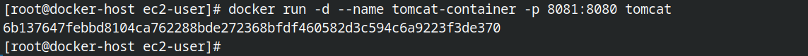

[see ansible](#ansible)<br>
[see docker](#docker)<br>

**How to connect into remote server:**

in your client do:

from the terminal type: `ssh-keygen` and complete the steps

which creates `id_rsa` and `id_rsa.pub` files in `~/.ssh/` directory

do `cat ~/.ssh/id_rsa.pub`

`copy` everything

**login to remote server**

`paste` the text in ~/.ssh/authorized_keys

Do login via: ssh ec2-user@< public ip >

## Docker 

docker images


#### shows every container including stopped/running
``` shell
docker ps -a
```

#### run a container detached mode 
``` shell
docker run -d --name tomcat-container -p 8081:8080 tomcat
```
-d : detached

--name tomcat-container : name of the container is tomcat-container

-p 8081:8080 : port inside 8080, external network

tomcat : name of the image (done by docker pull)




#### get inside container

``` shell
docker exec -it tomcat-container /bin/bash
```
exec : Execute a command in a running container

-i, &nbsp;&nbsp;&nbsp;&nbsp;--interactive &nbsp;&nbsp;&nbsp;&nbsp;Keep STDIN open even if not attached

&nbsp;&nbsp;&nbsp;&nbsp;&nbsp;&nbsp;&nbsp;&nbsp;--privileged &nbsp;&nbsp;&nbsp;&nbsp;Give extended privileges to the command

-t, &nbsp;&nbsp;&nbsp;&nbsp;--tty &nbsp;&nbsp;&nbsp;&nbsp;&nbsp;&nbsp;&nbsp;&nbsp;Allocate a pseudo-TTY


### stopping container
``` shell
docker stop <container-name>
```

### running Docker file:

``` shell
cd ~
touch Dockerfile
```
inside `Dockerfile`:
```
FROM fedora:latest
RUN yum install java -y
RUN mkdir /opt/tomcat
WORKDIR /opt/tomcat
ADD https://dlcdn.apache.org/tomcat/tomcat-10/v10.1.19/bin/apache-tomcat-10.1.19.tar.gz .
RUN tar -xvzf apache-tomcat-10.1.19.tar.gz
RUN mv apache-tomcat-10.1.19 tomcat
EXPOSE 8080
CMD ["/opt/tomcat/bin/catalina.sh", "run"]
```

``` shell
docker build -t mytomcat .
```
t &nbsp;&nbsp;&nbsp;&nbsp; Name and optionally a tag 


### docker remove container
```
docker rm <container name>
```

### delete all stopped containers

``` shell
docker container prune
```

### delete all images 
``` shell
docker image prune -a
```

## Ansible

> ansible all --list-hosts

> ansible all -m gather_facts

collects and shows all the informations like procssor, memory, all of your env varibles and more
***
> ansible all -m gather_facts --limit `<ipAddr>`

limit with one ip address
***
> ansible all -m apt -a update_cache=true --become --ask-become-pass

after this enter a sudo passwd of the local system it will give this response


### install vim-nox to server:
``` shell
ansible all -m apt -a name=vim-nox --become --ask-become-pass
```

#### updating perticular package:

``` shell
ansible all -m apt -a "name=openssl state=latest" --become --ask-become-pass
```
from the above code, we are updating `openssl` package


#### doing system upgrade and update:
``` shell
ansible all -m apt -a "upgrade=dist" --become --ask-become-pass
```

### install package via playbook:

``` shell
ansible-playbook --ask-become-pass install_apache.yml
```

### if server doesnt work then enable port 80
``` shell
sudo firewall-cmd --add-port=80/tcp
```

 