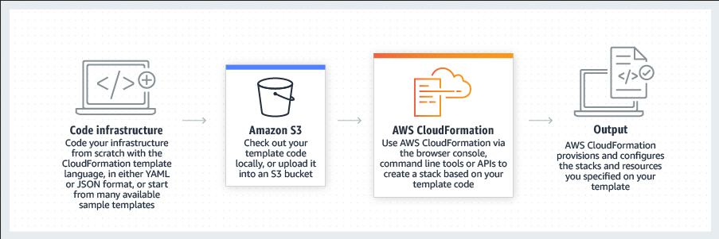
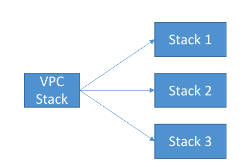

# AWS CloudFormation
Speed up cloud provisioning with `infrastructure as code`

AWS CloudFormation lets you model, provision, and manage AWS and third-party resources by treating infrastructure as code. 


## Use Cases

>### Manage infrastructure with DevOps
>Automate, test, and deploy infrastructure templates with continuous integration and delivery (CI/CD) automations.
>
>### Scale production stacks
>Run anything from a single Amazon Elastic Compute Cloud (EC2) instance to a complex multi-region application.
>
>### Share best practices
>Define an Amazon Virtual Private Cloud (VPC) subnet or provisioning services like AWS OpsWorks or Amazon Elastic Container Service (ECS) with ease.
***

### Simplify infrastructure management

For a scalable web application that also includes a backend database, you might use an Auto Scaling group, an Elastic Load Balancing load balancer, and an Amazon Relational Database Service database instance. You might use each individual service to provision these resources and after you create the resources, you would have to configure them to work together. All these tasks can add complexity and time before you even get your application up and running.

Instead, you can create a CloudFormation template or modify an existing one. A template describes all your resources and their properties. **When you use that template to create a CloudFormation stack, CloudFormation provisions the Auto Scaling group, load balancer, and database for you. After the stack has been successfully created, your AWS resources are up and running. You can delete the stack just as easily, which deletes all the resources in the stack.** By using CloudFormation, you easily manage a collection of resources as a single unit.

### Quickly replicate your infrastructure

If your application requires additional availability, you might replicate it in multiple regions so that if one region becomes unavailable, your users can still use your application in other regions. The challenge in replicating your application is that it also requires you to replicate your resources. Not only do you need to record all the resources that your application requires, but you must also provision and configure those resources in each region.

Reuse your CloudFormation template to create your resources in a consistent and repeatable manner. **To reuse your template, describe your resources once and then provision the same resources over and over in multiple regions**.

### Easily control and track changes to your infrastructure

In some cases, you might have underlying resources that you want to `upgrade` incrementally. For example, you might change to a higher performing instance type in your Auto Scaling launch configuration so that you can reduce the maximum number of instances in your Auto Scaling group. If problems occur after you complete the update, you might need to roll back your infrastructure to the original settings. To do this manually, you not only have to remember which resources were changed, you also have to know what the original settings were.

When you provision your infrastructure with CloudFormation, the CloudFormation template describes exactly what resources are provisioned and their settings. Because these templates are text files, you simply track differences in your templates to track changes to your infrastructure, similar to the way developers control revisions to source code. For example, you can use a `version control system with your templates so that you know exactly what changes were made, who made them, and when`. If at any point you need to reverse changes to your infrastructure, you can use a previous version of your template.

## AWS CloudFormation concepts

When you use AWS CloudFormation, you work with templates and stacks. You create templates to describe your AWS resources and their properties. Whenever you create a stack, CloudFormation provisions the resources that are described in your template.

- Templates
- Stacks
- Change sets

### Templates
***
A CloudFormation template is a JSON or YAML formatted text file. You can save these files with any extension, such as `.json`, `.yaml`, `.template`, or `.txt`. CloudFormation uses these templates as blueprints for building your AWS resources. For example, in a template, you can describe an Amazon EC2 instance, such as the instance type, the AMI ID, block device mappings, and its Amazon EC2 key pair name. Whenever you create a stack, you also specify a template that CloudFormation uses to create whatever you described in the template.

For example, if you created a stack with the following template, CloudFormation provisions an instance with an `ami-0ff8a91507f77f867` AMI ID, `t2.micro` instance type, `testkey` key pair name, and an Amazon EBS volume.


``` yaml
AWSTemplateFormatVersion: 2010-09-09
Description: A sample template
Resources:
  MyEC2Instance:
    Type: 'AWS::EC2::Instance'
    Properties:
      ImageId: ami-0ff8a91507f77f867
      InstanceType: t2.micro
      KeyName: testkey
      BlockDeviceMappings:
        - DeviceName: /dev/sdm
          Ebs:
            VolumeType: io1
            Iops: 200
            DeleteOnTermination: false
            VolumeSize: 20

```
### Stacks
***

When you use CloudFormation, you manage related resources as a single unit called a stack. You create, update, and delete a collection of resources by creating, updating, and deleting stacks. All the resources in a stack are defined by the stack's CloudFormation template. Suppose you created a template that includes an Auto Scaling group, Elastic Load Balancing load balancer, and an Amazon Relational Database Service (Amazon RDS) database instance. To create those resources, you create a stack by submitting the template that you created, and CloudFormation provisions all those resources for you. You can work with stacks by using the CloudFormation console
, API, or [AWS CLI](https://docs.aws.amazon.com/cli/latest/reference/cloudformation/).

### Change sets
***

If you need to make changes to the running resources in a stack, you update the stack. Before making changes to your resources, you can generate a change set, which is a summary of your proposed changes. `Change sets allow you to see how your changes might impact your running resources, especially for critical resources, before implementing them.`

For example, if you change the name of an Amazon RDS database instance, CloudFormation will create a new database and delete the old one. You will lose the data in the old database unless you've already backed it up. If you generate a change set, you will see that your change will cause your database to be replaced, and you will be able to plan accordingly before you update your stack. For more information, see [Updating stacks using change sets](https://docs.aws.amazon.com/AWSCloudFormation/latest/UserGuide/using-cfn-updating-stacks-changesets.html "See image of change set").

## How does AWS CloudFormation work?

When creating a stack, AWS CloudFormation makes underlying service calls to AWS to provision and configure your resources. CloudFormation can only perform actions that you have permission to do. For example, to create EC2 instances by using CloudFormation, you need permissions to create instances. You'll need similar permissions to terminate instances when you delete stacks with instances. You use AWS Identity and Access Management (IAM) to manage permissions.

The calls that CloudFormation makes are all declared by your template. For example, suppose you have a template that describes an EC2 instance with a `t2.micro` instance type. When you use that template to create a stack, CloudFormation calls the Amazon EC2 create instance API and specifies the instance type as `t2.micro`. The following diagram summarizes the CloudFormation workflow for creating stacks.


1. Use the `AWS CloudFormation Designer` or your own text editor to create or modify a CloudFormation template in JSON or YAML format. You can also choose to use a provided template. The CloudFormation template describes the resources you want and their settings. For example, suppose you want to create an EC2 instance. Your template can declare an Amazon EC2 instance and describe its properties, as shown in the following example:

``` yaml
AWSTemplateFormatVersion: 2010-09-09
Description: A simple EC2 instance
Resources:
  MyEC2Instance:
    Type: 'AWS::EC2::Instance'
    Properties:
      ImageId: ami-0ff8a91507f77f867
      InstanceType: t2.micro

```


2. Save the template locally or in an Amazon S3 bucket. If you created a template, save it with a file extension like: `.json`, `.yaml`, or `.txt`.

3. Create a CloudFormation stack by specifying the location of your template file, such as a path on your local computer or an Amazon S3 URL. If the template contains parameters, you can specify input values when you create the stack. Parameters allow you to pass in values to your template so that you can customize your resources each time you create a stack.

You can create stacks by using the CloudFormation console, API, or AWS CLI.

> **Note**
>
>If you specify a template file stored locally, CloudFormation uploads it to an S3 bucket in your AWS account. CloudFormation creates a bucket for each region in which you upload a template file. The buckets are accessible to anyone with Amazon Simple Storage Service (Amazon S3) permissions in your AWS account. If a bucket created by CloudFormation is already present, the template is added to that bucket.
>
>You can use your own bucket and manage its permissions by manually uploading templates to Amazon S3. Then whenever you create or update a stack, specify the Amazon S3 URL of a template file.


CloudFormation provisions and configures resources by making calls to the AWS services that are described in your template.

After all the resources have been created, CloudFormation reports that your stack has been created. You can then start using the resources in your stack. If stack creation fails, CloudFormation rolls back your changes by deleting the resources that it created.

## Updating a stack with change sets

When you need to update your stack's resources, you can modify the stack's template. You don't need to create a new stack and delete the old one. To update a stack, create a change set by submitting a modified version of the original stack template, different input parameter values, or both. CloudFormation compares the modified template with the original template and generates a change set. The change set lists the proposed changes. After reviewing the changes, you can start the change set to update your stack or you can create a new change set. The following diagram summarizes the workflow for updating a stack.


>💥 Important
>
>Updates can cause interruptions. Depending on the resource and properties that you are updating, an update might interrupt or even replace an existing resource. For more information, see [AWS CloudFormation stack updates](https://docs.aws.amazon.com/AWSCloudFormation/latest/UserGuide/using-cfn-updating-stacks.html).

1. You can modify a CloudFormation stack template by using AWS CloudFormation Designer or a text editor. For example, if you want to change the instance type for an EC2 instance, you would change the value of the `InstanceType` property in the original stack's template
2. Save the CloudFormation template locally or in an S3 bucket.

3. Create a change set by specifying the stack that you want to update and the location of the modified template, such as a path on your local computer or an Amazon S3 URL. If the template contains parameters, you can specify values when you create the change set.

> Note
>
>If you specify a template that's stored on your local computer, CloudFormation automatically uploads your template to an S3 bucket in your AWS account.

4. View the change set to check that CloudFormation will perform the changes that you expect. For example, check whether CloudFormation will replace any critical stack resources. You can create as many change sets as you need until you have included the changes that you want.

>💥 Important
>
><ins>Change sets don't indicate whether your stack update will be successful</ins>. For example, a change set doesn't check if you will surpass an account quota, if you're updating a resource that doesn't support updates, or if you have insufficient permissions to modify a resource, which can cause a stack update to fail.
5. Initiate the change set that you want to apply to your stack. CloudFormation updates your stack by updating only the resources that you modified and signals that your stack has been successfully updated. If the stack updates fails, CloudFormation rolls back changes to restore the stack to the last known working state.

## Deleting a stack

When you delete a stack, you specify the stack to delete, and CloudFormation deletes the stack and all the resources in that stack. You can delete stacks by using the CloudFormation console, API, or AWS CLI.

If you want to delete a stack but want to retain some resources in that stack, you can use a deletion policy to retain those resources.

After all the resources have been deleted, CloudFormation signals that your stack has been successfully deleted. If CloudFormation can't delete a resource, the stack won't be deleted. Any resources that haven't been deleted will remain until you can successfully delete the stack.

## Parameters

Use the optional Parameters section to customize your templates. Parameters enable you to input custom values to your template each time you create or update a stack

### Defining a parameter in a template
***
The following example declares a parameter named `InstanceTypeParameter`. This parameter lets you specify the Amazon EC2 instance type for the stack to use when you create or update the stack.

Note that `InstanceTypeParameter` has a default value of `t2.micro`. This is the value that AWS CloudFormation uses to provision the stack unless another value is provided

``` yaml
Parameters:
  InstanceTypeParameter:
    Type: String
    Default: t2.micro
    AllowedValues:
      - t2.micro
      - m1.small
      - m1.large
    Description: Enter t2.micro, m1.small, or m1.large. Default is t2.micro.
```
### Referencing a parameter within a template
***
You use the `Ref` intrinsic function to reference a parameter, and AWS CloudFormation uses the parameter's value to provision the stack. You can reference parameters from the `Resources` and `Outputs` sections of the same template.

In the following example, the `InstanceType` property of the EC2 instance resource references the `InstanceTypeParameter` parameter value:

``` yaml
Ec2Instance:
  Type: AWS::EC2::Instance
  Properties:
    InstanceType:
      Ref: InstanceTypeParameter
    ImageId: ami-0ff8a91507f77f867
```

### Pseudo parameters reference
Pseudo parameters are parameters that are predefined by AWS CloudFormation. You don't declare them in your template. Use them the same way as you would a parameter, as the argument for the `Ref` function.
``` yaml
Outputs:
  MyStacksRegion:
    Value: !Ref "AWS::Region"
```

### Mappings
***
The optional `Mappings` section matches a key to a corresponding set of named values. For example, if you want to set values based on a region, you can create a mapping that uses the region name as a key and contains the values you want to specify for each specific region. You use the `Fn::FindInMap` intrinsic function to retrieve values in a map.

You can't include parameters, pseudo parameters, or intrinsic functions in the `Mappings` section.

### Syntax

The `Mappings` section consists of the key name `Mappings`. The keys in mappings must be literal strings. The values can be `String` or `List` types. The following example shows a Mappings section containing a single mapping named `Mapping01` (the logical name).

Within a mapping, each map is a key followed by another mapping. The key must be a map of name-value pairs and unique within the mapping.
``` yaml
Mappings: 
  Mapping01: 
    Key01: 
      Name: Value01
    Key02: 
      Name: Value02
    Key03: 
      Name: Value03
```
Examples

``` yaml
Mappings: 
  RegionMap: 
    us-east-1: 
      "HVM64": "ami-0ff8a91507f77f867"
    us-west-1: 
      "HVM64": "ami-0bdb828fd58c52235"
    eu-west-1: 
      "HVM64": "ami-047bb4163c506cd98"
    ap-southeast-1: 
      "HVM64": "ami-08569b978cc4dfa10"
    ap-northeast-1: 
      "HVM64": "ami-06cd52961ce9f0d85"
```
### Mapping with multiple values
``` yaml
RegionMap: 
    us-east-1:
      HVM64: ami-0ff8a91507f77f867
      HVMG2: ami-0a584ac55a7631c0c
    us-west-1:
      HVM64: ami-0bdb828fd58c52235
      HVMG2: ami-066ee5fd4a9ef77f1
    eu-west-1:
      HVM64: ami-047bb4163c506cd98
      HVMG2: ami-0a7c483d527806435
    ap-northeast-1:
      HVM64: ami-06cd52961ce9f0d85
      HVMG2: ami-053cdd503598e4a9d
    ap-southeast-1:
      HVM64: ami-08569b978cc4dfa10
      HVMG2: ami-0be9df32ae9f92309
```
### Return a value from a mapping

You can use the `Fn::FindInMap` function to return a named value based on a specified key. The following example template contains an Amazon EC2 resource whose `ImageId` property is assigned by the `FindInMap` function. The `FindInMap` function specifies key as the region where the stack is created (using the `AWS::Region` pseudo parameter) and `HVM64` as the name of the value to map to.

``` yaml
AWSTemplateFormatVersion: "2010-09-09"
Mappings: 
  RegionMap: 
    us-east-1:
      HVM64: ami-0ff8a91507f77f867
      HVMG2: ami-0a584ac55a7631c0c
    us-west-1:
      HVM64: ami-0bdb828fd58c52235
      HVMG2: ami-066ee5fd4a9ef77f1
    eu-west-1:
      HVM64: ami-047bb4163c506cd98
      HVMG2: ami-0a7c483d527806435
    ap-northeast-1:
      HVM64: ami-06cd52961ce9f0d85
      HVMG2: ami-053cdd503598e4a9d
    ap-southeast-1:
      HVM64: ami-08569b978cc4dfa10
      HVMG2: ami-0be9df32ae9f92309
Resources: 
  myEC2Instance: 
    Type: "AWS::EC2::Instance"
    Properties: 
      ImageId: !FindInMap [RegionMap, !Ref "AWS::Region", HVM64]
      InstanceType: m1.small

```

### Input parameter and Fn::FindInMap

You can use an input parameter with the `Fn::FindInMap` function to refer to a specific value in a map. For example, suppose you have a list of regions and environment types that map to a specific AMI ID. You can select the AMI ID that your stack uses by using an input parameter (`EnvironmentType`). To determine the region, use the `AWS::Region` pseudo parameter, which gets the AWS Region in which you create the stack.

``` yaml
  Parameters: 
    EnvironmentType: 
      Description: The environment type
      Type: String
      Default: test
      AllowedValues: 
        - prod
        - test
      ConstraintDescription: must be a prod or test
  Mappings: 
    RegionAndInstanceTypeToAMIID: 
      us-east-1: 
        test: "ami-8ff710e2"
        prod: "ami-f5f41398"
      us-west-2: 
        test: "ami-eff1028f"
        prod: "ami-d0f506b0"
        
      ...other regions and AMI IDs...
  
  Resources:
  
   ...other resources...

  Outputs: 
    TestOutput: 
      Description: Return the name of the AMI ID that matches the region and environment type keys
      Value: !FindInMap [RegionAndInstanceTypeToAMIID, !Ref "AWS::Region", !Ref EnvironmentType]

```
## Outputs
The optional Outputs section declares output values that you can <ins>import into other stacks (to create cross-stack references),</ins> return in response (to describe stack calls), or view on the AWS CloudFormation console. For example, you can output the S3 bucket name for a stack to make the bucket easier to find.


> 💥 Important
>
>CloudFormation doesn't redact or obfuscate any information you include in the Outputs section. We strongly recommend you don't use this section to output sensitive information, such as passwords or secrets.
>
> Output values are available after the stack operation is complete. Stack output values aren't available when a stack status is in any of the `IN_PROGRESS` status. We don't recommend establishing dependencies between a service runtime and the stack output value because output values might not be available at all times.

``` yaml
Outputs:
  Logical ID:
    Description: Information about the value
    Value: Value to return
    Export:
      Name: Name of resource to export
  
```
### Output fields

The `Outputs` section can include the following fields.

**Logical ID**

  An identifier for the current output. The logical ID must be alphanumeric (`a–z`, `A–Z`, `0–9`) and unique within the template.

**Description (optional)**

  A `String` type that describes the output value. The value for the description declaration must be a literal string that's between 0 and 1024 bytes in length. You can't use a parameter or function to specify the description.

**Value (required)**

  The value of the property returned by the aws cloudformation describe-stacks command. The value of an output can include literals, parameter references, pseudo-parameters, a mapping value, or intrinsic functions.

**Export (optional)**

The name of the resource output to be exported for a cross-stack reference.

> **Note**
>
>The following restrictions apply to cross-stack references:
>
> - For each AWS account, `Export` names must be unique within a Region.
>
> - You can't create cross-stack references across Regions. You can use the intrinsic function `Fn::ImportValue` to import only values that have been exported within the same Region.
>
> - For outputs, the value of the `Name` property of an `Export` can't use `Ref` or `GetAtt` functions that depend on a resource.
>
> - Similarly, the ImportValue function can't include `Ref` or `GetAtt` functions that depend on a resource.
> - <ins>You can't delete a stack if another stack references one of its outputs.</ins>
> - You can't modify or remove an output value that is referenced by another stack.

### Examples
***
### Stack output
In the following example, the output named `BackupLoadBalancerDNSName` returns the DNS name for the resource with the logical ID `BackupLoadBalancer` only when the `CreateProdResources` condition is true. (The second output shows how to specify multiple outputs.)
``` yaml
Outputs:
  BackupLoadBalancerDNSName:
    Description: The DNSName of the backup load balancer
    Value: !GetAtt BackupLoadBalancer.DNSName
    Condition: CreateProdResources
  InstanceID:
    Description: The Instance ID
    Value: !Ref EC2Instance
```
### Cross-stack output

In the following examples, the output named `StackVPC` returns the ID of a VPC, and then exports the value for cross-stack referencing with the name `VPCID` appended to the stack's name.
``` yaml
Outputs:
  StackVPC:
    Description: The ID of the VPC
    Value: !Ref MyVPC
    Export:
      Name: !Sub "${AWS::StackName}-VPCID"
```

## Conditions
### How to use conditions overview

Depending on the entity you want to conditionally create or configure, you must include statements in the following template sections:

### Parameters section

  >Define the inputs that you want your conditions to evaluate. The conditions evaluate to true or false based on the values of these input parameters. If you want your conditions to evaluate pseudo parameters, you don't need to define the pseudo parameters in this section; pseudo parameters are predefined by AWS CloudFormation.

### Conditions section
>
>Define conditions by using the intrinsic condition functions. These conditions determine when AWS CloudFormation creates the associated resources.

### Resources and Outputs sections

> Associate conditions with the resources or outputs that you want to conditionally create. AWS CloudFormation creates entities that are associated with a true condition and ignores entities that are associated with a false condition. Use the Condition key and a condition's logical ID to associate it with a resource or output. To conditionally specify a property, use the Fn::If function.

### Syntax

The `Conditions` section consists of the key name `Conditions`. Each condition declaration includes a logical ID and intrinsic functions that are evaluated when you create or update a stack. The following pseudo template outlines the `Conditions` section:
``` yaml
Conditions:
  Logical ID:
    Intrinsic function
```

### Condition intrinsic functions

You can use the following intrinsic functions to define conditions:

- Fn::And

- Fn::Equals

- Fn::ForEach

- Fn::If

- Fn::Not

- Fn::Or

### Examples
***
### Simple condition

The following sample template includes an `EnvType` input parameter, where you can specify `prod` to create a stack for production or `test` to create a stack for testing. For a production environment, AWS CloudFormation creates an Amazon EC2 instance and attaches a volume to the instance. For a test environment, AWS CloudFormation creates only the Amazon EC2 instance.

The `CreateProdResources` condition evaluates to `true` if the `EnvType` parameter is equal to `prod`. In the sample template, the `NewVolume` and `MountPoint` resources are associated with the `CreateProdResources` condition. Therefore, the resources are created only if the `EnvType` parameter is equal to `prod`.
``` yaml
AWSTemplateFormatVersion: 2010-09-09
Parameters:
  EnvType:
    Description: Environment type.
    Default: test
    Type: String
    AllowedValues:
      - prod
      - test
    ConstraintDescription: must specify prod or test.
Conditions:
  CreateProdResources: !Equals 
    - !Ref EnvType
    - prod
Resources:
  EC2Instance:
    Type: 'AWS::EC2::Instance'
    Properties:
      ImageId: ami-0ff8a91507f77f867
  MountPoint:
    Type: 'AWS::EC2::VolumeAttachment'
    Condition: CreateProdResources
    Properties:
      InstanceId: !Ref EC2Instance
      VolumeId: !Ref NewVolume
      Device: /dev/sdh
  NewVolume:
    Type: 'AWS::EC2::Volume'
    Condition: CreateProdResources
    Properties:
      Size: 100
      AvailabilityZone: !GetAtt 
        - EC2Instance
        - AvailabilityZone
```
[click here to see nextect conditions](https://docs.aws.amazon.com/AWSCloudFormation/latest/UserGuide/conditions-section-structure.html)

### Fn::And

Returns `true` if all the specified conditions evaluate to `true`, or returns `false` if any one of the conditions evaluates to `false`. `Fn::And` acts as an AND operator. The minimum number of conditions that you can include is 2, and the maximum is 10.

Syntax
``` yaml
Fn::And: [condition]
```
syntax short form
``` yaml
!And [condition]
```
**Example**

The following `MyAndCondition` evaluates to true if the referenced security group name is equal to `sg-mysggroup` and if `SomeOtherCondition` evaluates to true:

``` yaml
MyAndCondition: !And
  - !Equals ["sg-mysggroup", !Ref ASecurityGroup]
  - !Condition SomeOtherCondition
```
***
### Fn::Equals

Compares if two values are equal. Returns `true` if the two values are equal or `false` if they aren't.

syntax
``` yaml
Fn::Equals: [value_1, value_2]
```
short syntax
``` yaml
!Equals [value_1, value_2]
```
**Example**

The following `UseProdCondition` condition evaluates to true if the value for the `EnvironmentType` parameter is equal to `prod`:
``` yaml
UseProdCondition:
  !Equals [!Ref EnvironmentType, prod]
```
***
### Fn::If

Returns one value if the specified condition evaluates to `true` and another value if the specified condition evaluates to `false`. Currently, CloudFormation supports the `Fn::If` intrinsic function in the metadata attribute, update policy attribute, and property values in the Resources section and Outputs sections of a template. You can use the `AWS::NoValue` pseudo parameter as a return value to remove the corresponding property.

syntax
``` yaml
Fn::If: [condition_name, value_if_true, value_if_false]
```

syntax short
``` yaml
!If [condition_name, value_if_true, value_if_false]
```
**Parameters**

condition_name

>A reference to a condition in the Conditions section. Use the condition's name to reference it.

value_if_true

>A value to be returned if the specified condition evaluates to true.

value_if_false
>A value to be returned if the specified condition evaluates to false.

Example

The following snippet uses an `Fn::If` function in the `SecurityGroups` property for an Amazon EC2 resource. If the `CreateNewSecurityGroup` condition evaluates to true, CloudFormation uses the referenced value of `NewSecurityGroup` to specify the SecurityGroups property; otherwise, CloudFormation uses the referenced value of `ExistingSecurityGroup`.

``` yaml
SecurityGroups:
  - !If [CreateNewSecurityGroup, !Ref NewSecurityGroup, !Ref ExistingSecurityGroup]
```
### cloudformation-stack-notification-check
Checks if your CloudFormation stacks send event notifications to an Amazon SNS topic. Optionally checks if specified Amazon SNS topics are used. The rule is NON_COMPLIANT if CloudFormation stacks do not send notifications.

## Working with nested stacks
Nested stacks are stacks created as part of other stacks. You create a nested stack within another stack by using the `AWS::CloudFormation::Stack resource`.

As your infrastructure grows, common patterns can emerge in which you declare the same components in multiple templates. You can separate out these common components and create dedicated templates for them. Then use the resource in your template to reference other templates, creating nested stacks.

For example, assume that you have a load balancer configuration that you use for most of your stacks. Instead of copying and pasting the same configurations into your templates, you can create a dedicated template for the load balancer. Then, you just use the resource to reference that template from within other templates.

Nested stacks can themselves contain other nested stacks, resulting in a hierarchy of stacks, as in the diagram below. The root stack is the top-level stack to which all the nested stacks ultimately belong. In addition, each nested stack has an immediate parent stack. For the first level of nested stacks, the root stack is also the parent stack. in the diagram below, for example:

- Stack A is the root stack for all the other, nested, stacks in the hierarchy.

- For stack B, stack A is both the parent stack, and the root stack.

- For stack D, stack C is the parent stack; while for stack C, stack B is the parent stack.


## CloudFormation – Cross vs Nested Stacks

### Cross Stacks
- Helpful when stacks have different lifecycles
- Use Outputs Export and Fn::ImportValue
- When you need to pass export values to many stacks (VPC Id, etc...)


### Nested Stacks
- Helpful when components must be re-used
- Ex: re-use how to properly configure an Application Load Balancer
- The nested stack only is important to the higher level stack (it’s not shared)


## Working with AWS CloudFormation StackSets
AWS CloudFormation StackSets extends the capability of stacks by enabling you to create, update, or delete stacks across multiple accounts and AWS Regions with a single operation. Using an administrator account, you define and manage an AWS CloudFormation template, and use the template as the basis for provisioning stacks into selected target accounts across specified AWS Regions.


### What is drift?

Drift detection enables you to detect whether a stack's actual configuration differs, or has drifted, from its expected configuration. Use CloudFormation to detect drift on an entire stack, or on individual resources within the stack. A` resource is considered to have drifted if any of its actual property values differ from the expected property values`. This includes if the property or resource has been deleted. A stack is considered to have drifted if one or more of its resources have drifted.

To determine whether a resource has drifted, CloudFormation determines the expected resource property values, as defined in the stack template and any values specified as template parameters. CloudFormation then compares those expected values with the actual values of those resource properties as they currently exist in the stack. `A resource is considered to have drifted if one or more of its properties have been deleted, or had their value changed`.

CloudFormation generates detailed information on each resource in the stack that has drifted.


---

---

---

## CloudFormation stack policies
Stack policies can help prevent stack resources from being unintentionally updated or deleted during a stack update. A stack policy is a JSON document that defines the update actions that can be performed on designated resources. By default, any IAM principal with `cloudformation:UpdateStack` permissions can update all of the resources in an AWS CloudFormation stack. Updates can cause interruptions, or they can completely delete and replace resources. You can use a stack policy to help configure least-privilege permissions. The stack policies can provide an extra layer of protection.

By default, a stack policy helps protect all resources in the stack. However, <ins>the main benefit of stack policies that they provide granular control for each AWS resource deployed in a CloudFormation stack. You can use a stack policy to help protect only specific resources in a stack and allow updates or deletion of other resources in the same stack. To allow updates for specific resources, you include an explicit Allow statement for those resources in your stack policy.</ins>

Stack policies provide preventive controls for the CloudFormation stacks they are attached to. Each stack can have only one stack policy, but you can use that stack policy to help` protect all resources within that stack`. You can apply a stack policy to multiple stacks.

<ins>For example, imagine you have a pipeline that produces sensitive artifacts and stores them in an Amazon Simple Storage Service (Amazon S3) bucket temporarily for further processing. The S3 bucket is provisioned by CloudFormation, and all of the necessary security controls are in place. Without stack policies, a developer might intentionally or unintentionally change the destination of the pipeline artifacts to a less secure S3 bucket and expose sensitive data. If you have a stack policy applied to the stack, it prevents authorized users from performing unwanted update or delete actions.</ins>

The following sample policy allows the IAM principal to attach stack policies that are stored in a team-specific folder in an S3 bucket. You can store approved stack policies in this bucket.
``` json
{
    “Version”: “2012-10-17”,
    “Statement”: [
        {
            “Effect”: “Allow”,
            “Action”: [
                “cloudformation:SetStackPolicy”
            ],
            “Resource”: “*”,
            “Condition”: {
                “StringLike”: {
                    “cloudformation:StackPolicyUrl”: “<Bucket URL>/<Team folder>/*”
                }
            }
        }
    ]
}
```
This policy statement doesn't require an IAM principal to assign a stack policy to every stack. Even if the IAM principal has permissions to create stacks with a specific stack policy, they could choose to create a stack that doesn't have a stack policy.

[see requiring stack policies](https://docs.aws.amazon.com/prescriptive-guidance/latest/least-privilege-cloudformation/limiting-and-requiring-stack-policies.html#requiring-stack-policies)

> Note
>
>SCPs and permissions boundaries are permissions guardrails that define the maximum available permissions for IAM principals in an account or organization. These policies do not grant permissions to the IAM principals. If you want to standardize the requirement that all IAM principals in your account or organization assign stack policies, you need to use both permission guardrails and the identity-based policies.

