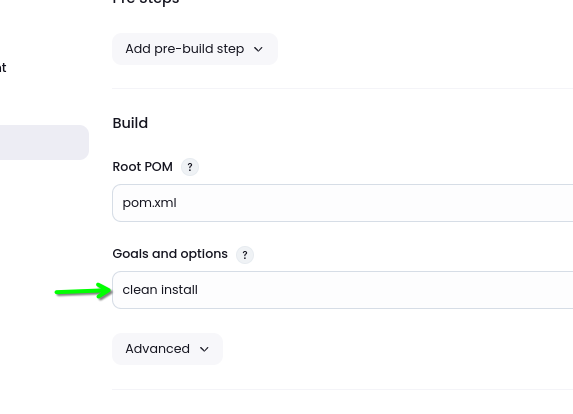
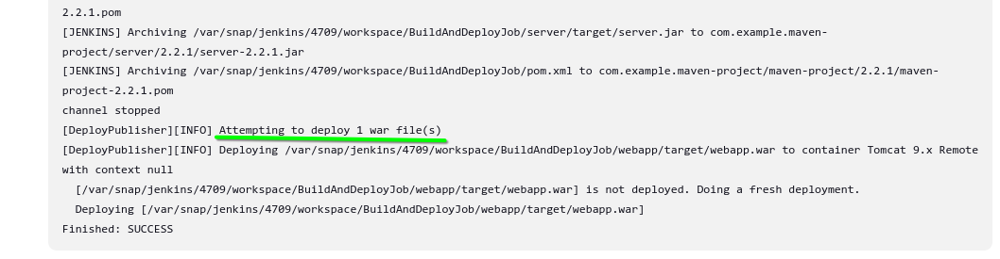

## Configuring github

project url: 👉[click here](https://github.com/Sharath44665/hello-world-aws-devops)👈

install git in your local machine, then goto jenkins dashboard -> manage jenkins -> plugins


search github (click on available plugins):


after that, manage plugins. jenkins dashboard -> manage jenkins -> tools


click apply and save from the above picture.

## How to pull the code from github

create a freestyle project:


configure project:


click on build now, 

look into logs, or **console output** from the build, then, do this:


## How we build the above code?

present working directory: `/root`

``` shell
wget https://dlcdn.apache.org/maven/maven-3/3.9.8/binaries/apache-maven-3.9.8-bin.tar.gz
tar xzvf apache-maven-3.9.8-bin.tar.gz
mv apache-maven-3.9.8 maven

cd maven/

cd bin/

./mvn -v

find / -name jvm

vim .profile 
```
inside `.profile` :

``` shell
M2_HOME=/opt/maven
M2=/opt/maven/bin
JAVA_HOME=/usr/lib/jvm/java-17-openjdk-amd64

PATH=$PATH:$HOME/bin:$JAVA_HOME:$M2:$M2_HOME

export PATH
```

``` shell
source .profile 
```

after this install maven plugin in jenkins using previous step (hint: see the step used in installing github plugin)

setup these in `manage jenkins`:


apply and save above configurations

### Maven build:


add git



apply and save the above step

the default lifecycle comprises of the following phases (for a complete list of the lifecycle phases, refer to the [Lifecycle Reference](https://maven.apache.org/guides/introduction/introduction-to-the-lifecycle.html#Lifecycle_Reference)):

- validate - validate the project is correct and all necessary information is available
- compile - compile the source code of the project
- test - test the compiled source code using a suitable unit testing framework. These tests should not require the code be packaged or deployed
- package - take the compiled code and package it in its distributable format, such as a JAR.
- verify - run any checks on results of integration tests to ensure quality criteria are met
- install - install the package into the local repository, for use as a dependency in other projects locally
- deploy - done in the build environment, copies the final package to the remote repository for sharing with other developers and projects.


then build now

takes time to build because its first time. see `console output`.


from the above output, that was were artifacts(that war file is artifact) are created, Yes we can check the same location in terminal.


from the above, its the same location but shown in the gui.

recap: we have completed the following step as shown in figure:


---

## Deploying to the Server

here we are using tomcat server

not necessary step: i want to start tomcat in 8585, because port 8080 is already in use.
``` shell
wget https://dlcdn.apache.org/tomcat/tomcat-9/v9.0.91/bin/apache-tomcat-9.0.91.tar.gz
tar xzvf apache-tomcat-9.0.91.tar.gz 
mv apache-tomcat-9.0.91 tomcat
cd conf/
cat server.xml 
vim server.xml 
```

inside `server.xml` locate this and change like `port` to below:
``` xml
<Connector port="8585" protocol="HTTP/1.1"
```

``` shell
cd bin/
ls
./startup.sh 
```


from the above, click on `manager app`

you might see this error:

error:

```
403 Access Denied
You are not authorized to view this page.

By default the Manager is only accessible from a browser running on the same machine as Tomcat. If you wish to modify this restriction, you'll need to edit the Manager's context.xml file.
```

solving the above error:


add comment as below, for both the files underlined and located `context.xml`:


`shutdown` and `start` tomcat server.

now manager app looks like this - meaning its working


update user.xml:


add this line in at end `tomcat-users.xml`
``` xml
<role rolename="manager-gui"/>
<role rolename="manager-script"/>
<role rolename="manager-jmx"/>
<role rolename="manager-status"/>
<user username="admin" password="admin" roles="manager-gui, manager-script, manager-jmx, manager-status"/>
<user username="deployer" password="deployer" roles="manager-script"/>
<user username="tomcat" password="s3cret" roles="manager-gui"/>
```

create a link file, because everytime going tomcat directory and `start` and `shutdown` service is sh!t

``` shell
echo $PATH
```

```
/usr/local/sbin:/usr/local/bin:/usr/sbin:/usr/bin:/sbin:/bin:/snap/bin
```

``` shell
ln -s /opt/tomcat/bin/startup.sh /usr/bin/tomcatup
ln -s /opt/tomcat/bin/shutdown.sh /usr/bin/tomcatdown
```

now do `tomcatdown` and `tomcatup`

login with tomcat creadential, `manager app` should work fine

using `jenkins dashboard` add plugin `deploy to container`

then go to `dashboard`  -> `manage jenkins` -> `credentials`

click on `system`

click on `global creadentials`

click on `add credentials`

save the following:


create a new job ( `new item` ) - maven

- fill git information
- add `Goals and options`

in `post build actioins` options:

select `deploy war/ear to container`





from the above pic, click on `webapps`


