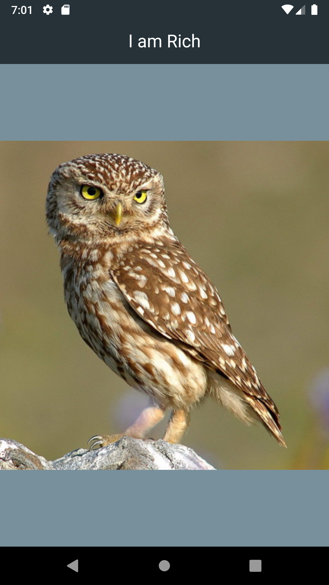

### Hello world

``` dart
import 'package:flutter/material.dart';

void main() {
  runApp(
    MaterialApp(
      home: Center(
        child: Text('Hello world'),
      ),
    ),
  );
}
```


**Tip**: alt + enter -> to wrap it with center or something else... see the option

### adding network image in center

``` dart
import 'package:flutter/material.dart';

void main() {
  runApp(
    MaterialApp(
      home: Scaffold(
        appBar: AppBar(
          title: Text('I am Rich'),
          centerTitle: true,
          foregroundColor: Colors.white,
          backgroundColor: Colors.blueGrey[900],
        ),
        body: Center(
          child: Image(
            image: NetworkImage(
                'https://flutter.github.io/assets-for-api-docs/assets/widgets/owl.jpg'),
          ),
        ),
        backgroundColor: Colors.blueGrey[400],
      ),
      debugShowCheckedModeBanner: false,
    ),
  );
}

```


### adding local image

``` dart
// need to change yaml file
import 'package:flutter/material.dart';

void main() {
  runApp(
    MaterialApp(
      home: Scaffold(
        appBar: AppBar(
          title: Text('I am Rich'),
          centerTitle: true,
          foregroundColor: Colors.white,
          backgroundColor: Colors.blueGrey[900],
        ),
        body: Center(
          child: Image(
            image: AssetImage('images/diamond.png'),
          ),
        ),
        backgroundColor: Colors.blueGrey[400],
      ),
      debugShowCheckedModeBanner: false,
    ),
  );
}

```
