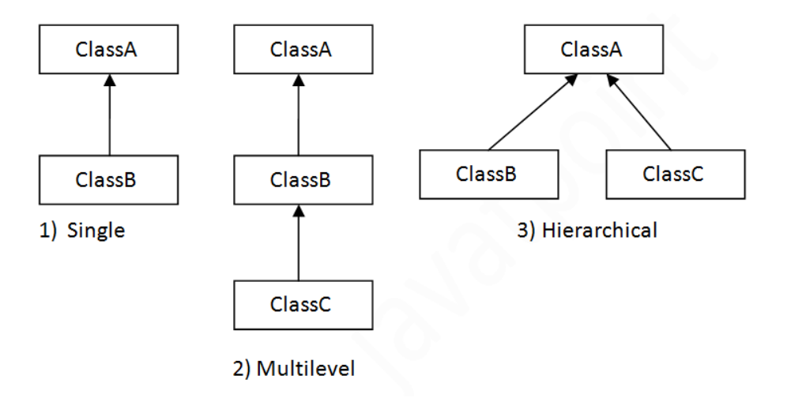
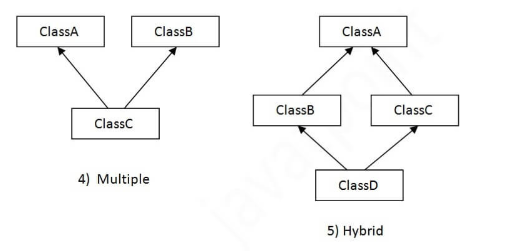
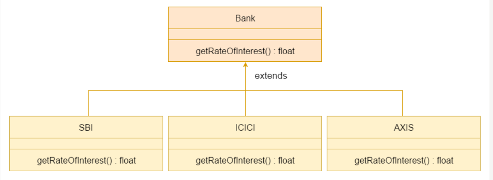
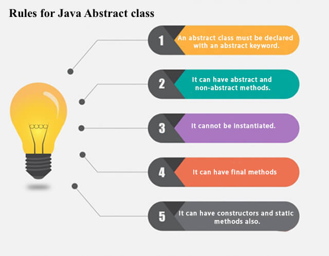
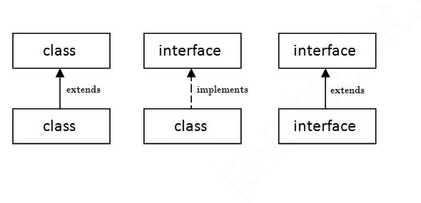
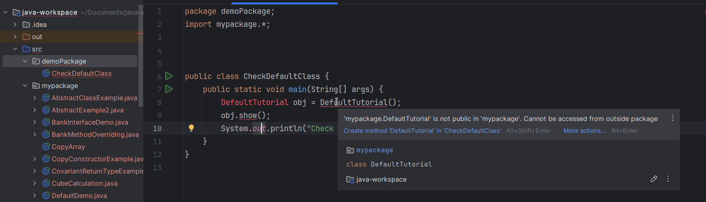

**static**: The core advantage of the static method is that <ins>there is no need to create an object to invoke the static method</ins>

#### Types of Variables
1. **Local Variable**:

A variable declared inside the body of the method is called local variable. You can use this variable only within that method and the other methods in the class aren't even aware that the variable exists.

A local variable cannot be defined with "static" keyword.

2. **Instance Variable**:

A variable declared <ins>inside the class</ins> but outside the body of the method, is called an instance variable. It is not declared as static.

It is called an instance variable because its value is instance-specific and is not shared among instances.

3. **Static variable**:

A variable that is declared as static is called a static variable. It cannot be local. You can create a single copy of the static variable and `share it among all the instances` of the class. `Memory allocation for static variables happens only once when the class is loaded in the memory`

``` java
public class A  
{  
    static int m=100;//static variable  
    void method()  
    {    
        int n=90;//local variable    
    }  
    public static void main(String args[])  
    {  
        int data=50;//instance variable    
    }  
}//end of class   
```
### Object Definitions:

- An object is a real-world entity.
- An object is a runtime entity.
- The object is an entity which has state and behavior.
- `The object is an instance of a class`.

### class in Java
A class is a group of objects which have common properties. It is a template or `blueprint from which objects are created`. It is a logical entity. It can't be physical.

**examples in Repo:**

- [Student](https://github.com/Sharath44665/java-workspace/blob/main/src/mypackage/Student.java)
- [EmployeeData](https://github.com/Sharath44665/java-workspace/blob/main/src/mypackage/EmployeeData.java)
- [SimpleBank](https://github.com/Sharath44665/java-workspace/blob/main/src/mypackage/SimpleBank.java)

### Constructor in Java

constructor is a block of codes similar to the method. It is called when an instance of the class is created. At the time of calling constructor, memory for the object is allocated in the memory.

- [StudentConstructorExample](https://github.com/Sharath44665/java-workspace/blob/main/src/mypackage/StudentConstructorExample.java)

**Constructor overloading** # see google, tip same as method overloading but with constructor

**Copy Constructor**: 

``` java
package mypackage;

class StudentCopyConstr {
	int id;
	String name;

	StudentCopyConstr(int id, String name) {
		this.id = id;
		this.name = name;
	}

	StudentCopyConstr(StudentCopyConstr user) { // copy constructor
		id = user.id;
		name = user.name;
	}

	void display() {
		System.out.println("id: " + id + " name: " + name);
	}

}

public class CopyConstructorExample {

	public static void main(String[] args) {
		// TODO Auto-generated method stub
		StudentCopyConstr userOne = new StudentCopyConstr(101, "Sharath");

		StudentCopyConstr userTwo = new StudentCopyConstr(userOne); // copy constructor
		userTwo.display();

	}

}
```
### static variable:
- [ExampleStaticVariable](https://github.com/Sharath44665/java-workspace/blob/main/src/mypackage/ExampleStaticVariable.java) 
- [Example2StaticVariable](https://github.com/Sharath44665/java-workspace/blob/main/src/mypackage/Example2StaticVariable.java)
- [CubeCalculation](https://github.com/Sharath44665/java-workspace/blob/main/src/mypackage/CubeCalculation.java)
- [ExampleStaticBlock](https://github.com/Sharath44665/java-workspace/blob/main/src/mypackage/ExampleStaticBlock.java)

### Inheritance
- **Class:** A class is a group of objects which have common properties. It is a template or blueprint from which objects are created.
- **Sub Class/Child Class:** Subclass is a class which inherits the other class. It is also called a derived class, extended class, or child class.
- **Super Class/Parent Class:** Superclass is the class from where a subclass inherits the features. It is also called a base class or a parent class.

|  |  |
| -- | -- |

- ExampleInheritance

**Why multiple inheritance is not supported in java?**

To reduce the complexity and simplify the language, multiple inheritance is not supported in java.

**Usage of Java Method Overriding**:
- Method overriding is used to provide the specific implementation of a method which is already provided by its superclass
- Method overriding is used for runtime polymorphism

**Rules for Java Method Overriding**:
1. The method must have the same name as in the parent class
2. The method must have the same parameter as in the parent class.
3. There must be an IS-A relationship (inheritance).

**Method Overriding Bank Example**:



[☝️click for code](https://github.com/Sharath44665/java-workspace/blob/main/src/mypackage/BankMethodOverriding.java)

**Can we override static method?**

No, a static method cannot be overridden. It can be proved by runtime polymorphism, so we will learn it later.

**Can we override java main method?**

No, because the main is a static method.

**Super Keyword**
1. super is used to refer immediate parent class instance variable.
2. super can be used to invoke parent class method
3. super is used to invoke parent class constructor.

> [SuperVariableExample](https://github.com/Sharath44665/java-workspace/blob/main/src/mypackage/SuperVariableExample.java), [SuperMethodExample](https://github.com/Sharath44665/java-workspace/blob/main/src/mypackage/SuperMethodExample.java), [SuperInvokeConstructor](https://github.com/Sharath44665/java-workspace/blob/main/src/mypackage/SuperInvokeConstructor.java), [SuperExample](https://github.com/Sharath44665/java-workspace/blob/main/src/mypackage/SuperExample.java)


**What is invoked first, instance initializer block or constructor?**

> InitializerBlockExample, InitializerBlockExample2
``` java
package mypackage;
class Bike_IB{
    Bike_IB(){
        System.out.println("Bike Object is created"); // this executes last
    }
    {
        System.out.println("This is a Initializer Block"); // this executes first
    }
}
public class InitializerBlockExample {
    public static void main(String[] args) {
        Bike_IB firstBike = new Bike_IB();
        Bike_IB secondBike = new Bike_IB();
        
    }
}
```
**Output:**
> This is a Initializer Block
> 
> Bike Object is created
>
> This is a Initializer Block
>
> Bike Object is created

**final variable**

**Abstract in Java**



> [AbstractClassExample](https://github.com/Sharath44665/java-workspace/blob/main/src/mypackage/AbstractClassExample.java), [AbstractExample2](https://github.com/Sharath44665/java-workspace/blob/main/src/mypackage/AbstractExample2.java)

**Interface in Java**

An interface in Java <ins>is a blueprint of a class</ins>. It has static constants and abstract methods.

The interface in Java is a mechanism to achieve abstraction

**Why use Java interface?**

- It is used to achieve <ins>abstraction</ins>.
- By interface, we can support the functionality of <ins>multiple inheritance</ins>.
- It can be used to achieve loose coupling.




### Access Modifiers in Java

**Private**: The access level of a private modifier is only within the class. It cannot be accessed from outside the class.

**Default**: The access level of a default modifier is only within the package. It cannot be accessed from outside the package. If you do not specify any access level, it will be the default.

**Protected**: The access level of a protected modifier is within the package and outside the package through child class. If you do not make the child class, it cannot be accessed from outside the package.

**Public**: The access level of a public modifier is everywhere. It can be accessed from within the class, outside the class, within the package and outside the package.

**Default access modifier in another package**:


| Access Modifier | within class | within package | outside package by subclass only | outside package |
| -- | -- | -- | -- | -- |
| **Private** | Y | N | N | N |
| **Default** | Y | Y | N | N |
| **Protected** | Y | Y | Y | N |
| **Public** | Y | Y | Y | Y |

### Call by value and reference
> [CallByValueDemo2](https://github.com/Sharath44665/java-workspace/blob/main/src/mypackage/CallByValueDemo2.java), [CallByValueDemo](https://github.com/Sharath44665/java-workspace/blob/main/src/mypackage/CallByValueDemo.java)
    
### String
> ImmutableStringDemo, ImmutableStringDemo2, StringEqualsDemo

#### Exception
> ThrowDemo, UserDefinedExceptioinDemo

#### ArrayList
> ArrayListDemo, ArrayListDemo2, IteratorDemo, ForEachDemo, SetArrayListDemo, TraversingArrayLIstDemo, StudentDemoAL <-> UserDefinedAL

#### Create Table
attach video how to add class path in vs code

> ConnectJavaToMariaDBDemo


