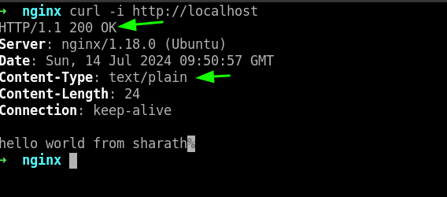
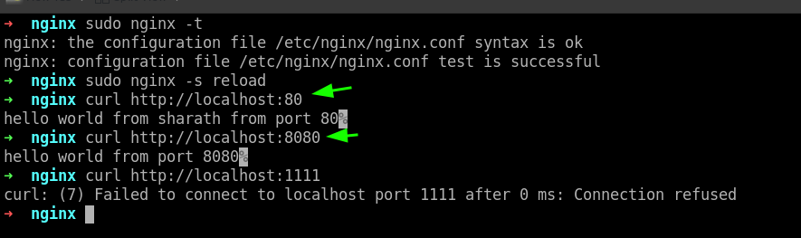
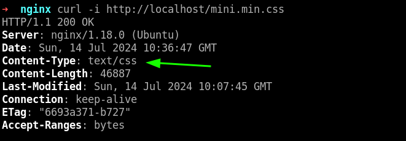
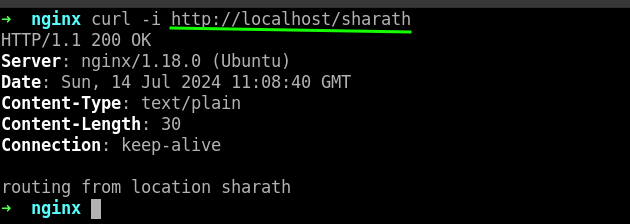
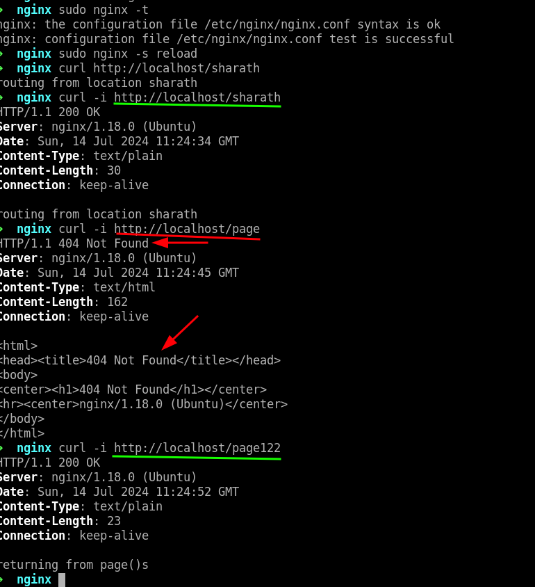
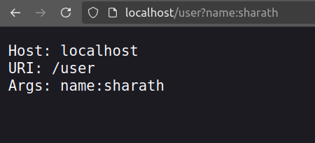
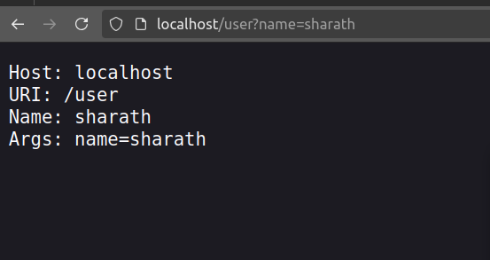
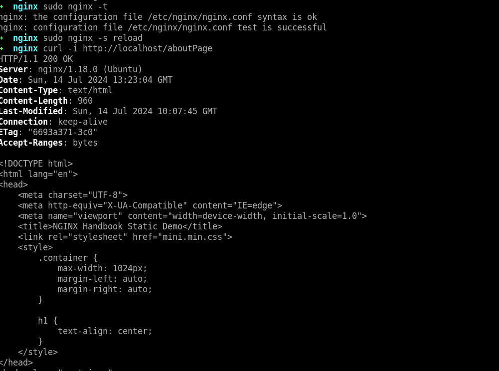

# Nginx Handbook

### check status of nginx:

ofcourse, first you need to install nginx
``` shell
sudo systemctl status nginx.service
```

`nginx.conf` file exist in `/etc/nginx`

rename the existing `nginx.conf` file as `nginx.conf.backup`

```
sudo mv nginx.conf nginx.conf.backup

sudo touch nginx.conf
```

```
events {}

http {

        server {
                listen 80;
                server_name nginx-helloworld.test;

                return 200 "hello world from sharath";
        }
}
```

test nginx:

``` shell
sudo nginx -t
```

reload nginx:

``` shell
sudo nginx -s reload 
```

in the browser do this:


terminal Output:



### Listen in different ports:

```
events {}

http {

        server {
                listen 80;
                server_name nginx-helloworld.test;

                return 200 "hello world from sharath from port 80";
        }

        server {
                listen 8080;
                server_name nginx-helloworld.test;

                return 200 "hello world from port 8080";
        }
}
```

output:




### Serve static content using Nginx:

```
events {}

http {

        server {
                listen 80;
                server_name nginx-helloworld.test;

                root /var/www/html/static-demo;
        }
}
```

test and reload the nginx 

see the web page:


from the above pic, there may be problem in css, but in reality its the problem of configuration file

debugging:


#### load the mime:

```
events {}

http {
        include /etc/nginx/mime.types;


        server {
                listen 80;
                server_name nginx-helloworld.test;

                root /var/www/html/static-demo;
        }
}
```

see the difference




### Routing in Nginx

nginx.conf:

```
events {}

http {


        server {
                listen 80;
                server_name nginx-helloworld.test;

                location /sharath {
                        return 200 "routing from location sharath\n";
                }

        }
}

```



from the above screenshot if you do `curl -i http://localhost/sharathchandra`, you still get the same response as above

#### To perform exact match

```
events {}

http {


        server {
                listen 80;
                server_name nginx-helloworld.test;

                location = /sharath {
                        return 200 "routing from location sharath\n";
                }

        }
}
```

test and reload nginx, run the previous code to see the difference

#### regx Match

```
events {}

http {


        server {
                listen 80;
                server_name nginx-helloworld.test;

                location = /sharath {
                        return 200 "routing from location sharath\n";
                }

                location ~ /page[0-9] {
                        return 200 "returning from page()s\n";
                }

        }
}

```



**case insensitive:**


to make case insensitive, do this:

```
events {}

http {


        server {
                listen 80;
                server_name nginx-helloworld.test;

                location = /sharath {
                        return 200 "routing from location sharath\n";
                }

                location ~* /page[0-9] {
                        return 200 "returning from page()s\n";
                }

        }
}

```


**lets check priority:**

```
events {}

http {


        server {
                listen 80;
                server_name nginx-helloworld.test;

                location = /sharath {
                        return 200 "routing from location sharath\n";
                }

                location /Page2 {
                        return 200 "Page 2 found - no pattern matching\n";
                }

                location ~* /page[0-9] {
                        return 200 "Page 2 found - pattern matching\n";
                }

        }
}

```


**Above priority can be changed a little:**

using `^~` , we can make the priority which is our preferential

```
events {}

http {


        server {
                listen 80;
                server_name nginx-helloworld.test;

                location = /sharath {
                        return 200 "routing from location sharath\n";
                }

                location ^~ /Page2 {
                        return 200 "Page 2 found - priority changed by me\n";
                }

                location ~* /page[0-9] {
                        return 200 "Page 2 found - pattern matching\n";
                }

        }
}

```

Priority can be listed as follows first row being highest priority, second row less priority as compared to first row and moving on


<table>
<tr>
<th>
Match
</th>
<th>
Modifier
</th>
</tr>
<tr>
<td>
Exact
</td>
<td>

`=`
</td>
</tr>
<tr>
<td>
Preferential Prefix 
</td>
<td>

`^~`
</td>
</tr>
<tr>
<td>
regx
</td>
<td>

`~` or `~*`
</td>
</tr>
<tr>
<td>
Prefix Match
</td>
<td>
None
</td>
</tr>
</table>

### Passing Arguments:

```
events {}

http {


        server {
                listen 80;
                server_name nginx-helloworld.test;

                return 200 "Host: $host\nURI: $uri\nArgs: $args\n";
        }
}
```



from above, Instead of printing the literal string form of the query strings, you can access the individual values using the `$arg` variable.

```
events {}

http {


        server {
                listen 80;
                server_name nginx-helloworld.test;

                set $name $arg_name;

                return 200 "Host: $host\nURI: $uri\nName: $name\nArgs: $args\n";
        }
}
```



### Redirects and rewrites

redirecting

```
events {}

http {
        include /etc/nginx/mime.types;

        server {
                listen 80;
                server_name nginx-helloworld.test;

                root /var/www/html/static-demo;

                location = /indexPage {
                        return 307 /index.html;
                }

                location = /aboutPage {
                        return 307 /about.html;
                }

        }
}
```


rewriting:

```
events {}

http {
        include /etc/nginx/mime.types;

        server {
                listen 80;
                server_name nginx-helloworld.test;

                root /var/www/html/static-demo;

                rewrite /indexPage /index.html;
                rewrite /aboutPage /about.html;
        }
}
```




