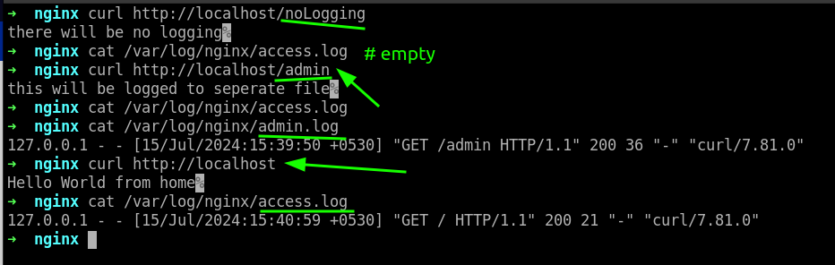
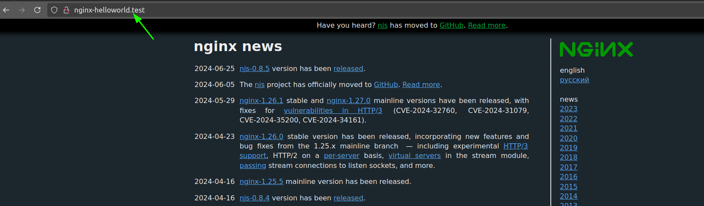

# Nginx Handbook

### check status of nginx:

ofcourse, first you need to install nginx
``` shell
sudo systemctl status nginx.service
```

`nginx.conf` file exist in `/etc/nginx`

rename the existing `nginx.conf` file as `nginx.conf.backup`

```
sudo mv nginx.conf nginx.conf.backup

sudo touch nginx.conf
```

```
events {}

http {

        server {
                listen 80;
                server_name nginx-helloworld.test;

                return 200 "hello world from sharath";
        }
}
```

test nginx:

``` shell
sudo nginx -t
```

reload nginx:

``` shell
sudo nginx -s reload 
```

in the browser do this:


terminal Output:


### Listen in different ports:

```
events {}

http {

        server {
                listen 80;
                server_name nginx-helloworld.test;

                return 200 "hello world from sharath from port 80";
        }

        server {
                listen 8080;
                server_name nginx-helloworld.test;

                return 200 "hello world from port 8080";
        }
}
```

output:


### Serve static content using Nginx:

```
events {}

http {

        server {
                listen 80;
                server_name nginx-helloworld.test;

                root /var/www/html/static-demo;
        }
}
```

test and reload the nginx 

see the web page:


from the above pic, there may be problem in css, but in reality its the problem of configuration file

debugging:


#### load the mime:

```
events {}

http {
        include /etc/nginx/mime.types;


        server {
                listen 80;
                server_name nginx-helloworld.test;

                root /var/www/html/static-demo;
        }
}
```

see the difference


### Routing in Nginx

nginx.conf:

```
events {}

http {


        server {
                listen 80;
                server_name nginx-helloworld.test;

                location /sharath {
                        return 200 "routing from location sharath\n";
                }

        }
}

```


from the above screenshot if you do `curl -i http://localhost/sharathchandra`, you still get the same response as above

#### To perform exact match

```
events {}

http {


        server {
                listen 80;
                server_name nginx-helloworld.test;

                location = /sharath {
                        return 200 "routing from location sharath\n";
                }

        }
}
```

test and reload nginx, run the previous code to see the difference

#### regx Match

```
events {}

http {


        server {
                listen 80;
                server_name nginx-helloworld.test;

                location = /sharath {
                        return 200 "routing from location sharath\n";
                }

                location ~ /page[0-9] {
                        return 200 "returning from page()s\n";
                }

        }
}

```


**case insensitive:**


to make case insensitive, do this:

```
events {}

http {


        server {
                listen 80;
                server_name nginx-helloworld.test;

                location = /sharath {
                        return 200 "routing from location sharath\n";
                }

                location ~* /page[0-9] {
                        return 200 "returning from page()s\n";
                }

        }
}

```


**lets check priority:**

```
events {}

http {


        server {
                listen 80;
                server_name nginx-helloworld.test;

                location = /sharath {
                        return 200 "routing from location sharath\n";
                }

                location /Page2 {
                        return 200 "Page 2 found - no pattern matching\n";
                }

                location ~* /page[0-9] {
                        return 200 "Page 2 found - pattern matching\n";
                }

        }
}

```


**Above priority can be changed a little:**

using `^~` , we can make the priority which is our preferential

```
events {}

http {


        server {
                listen 80;
                server_name nginx-helloworld.test;

                location = /sharath {
                        return 200 "routing from location sharath\n";
                }

                location ^~ /Page2 {
                        return 200 "Page 2 found - priority changed by me\n";
                }

                location ~* /page[0-9] {
                        return 200 "Page 2 found - pattern matching\n";
                }

        }
}

```

Priority can be listed as follows first row being highest priority, second row less priority as compared to first row and moving on


<table>
<tr>
<th>
Match
</th>
<th>
Modifier
</th>
</tr>
<tr>
<td>
Exact
</td>
<td>

`=`
</td>
</tr>
<tr>
<td>
Preferential Prefix 
</td>
<td>

`^~`
</td>
</tr>
<tr>
<td>
regx
</td>
<td>

`~` or `~*`
</td>
</tr>
<tr>
<td>
Prefix Match
</td>
<td>
None
</td>
</tr>
</table>

### Passing Arguments:

```
events {}

http {


        server {
                listen 80;
                server_name nginx-helloworld.test;

                return 200 "Host: $host\nURI: $uri\nArgs: $args\n";
        }
}
```


from above, Instead of printing the literal string form of the query strings, you can access the individual values using the `$arg` variable.

```
events {}

http {


        server {
                listen 80;
                server_name nginx-helloworld.test;

                set $name $arg_name;

                return 200 "Host: $host\nURI: $uri\nName: $name\nArgs: $args\n";
        }
}
```


### Redirects and rewrites

redirecting

```
events {}

http {
        include /etc/nginx/mime.types;

        server {
                listen 80;
                server_name nginx-helloworld.test;

                root /var/www/html/static-demo;

                location = /indexPage {
                        return 307 /index.html;
                }

                location = /aboutPage {
                        return 307 /about.html;
                }

        }
}
```


rewriting:

```
events {}

http {
        include /etc/nginx/mime.types;

        server {
                listen 80;
                server_name nginx-helloworld.test;

                root /var/www/html/static-demo;

                rewrite /indexPage /index.html;
                rewrite /aboutPage /about.html;
        }
}
```


### try_files directive:

```
events {}

http {
        include /etc/nginx/mime.types;

        server {
                listen 80;
                server_name nginx-helloworld.test;

                root /var/www/html/static-demo;

                try_files /the-nginx-handbook.jpg /notFound;

                location /notFound {
                        return 404 "the file was not found";
                }
        }
}
```

test, reload and go to `http://localhost/` 

=> 


Now the problem with writing a `try_files` directive this way is that no matter what URL you visit, as long as a request is received by the server and the the-nginx-handbook.jpg file is found on the disk, NGINX will send that back.Now the problem with writing a `try_files` directive this way is that no matter what URL you visit, as long as a request is received by the server and the the-nginx-handbook.jpg file is found on the disk, NGINX will send that back.

meaning of above line, if you do `http://localhost/dummy.png`, you still get the same response as you see in the above pic

we can avoid the above bug by doing this:

```
events {}

http {
        include /etc/nginx/mime.types;

        server {
                listen 80;
                server_name nginx-helloworld.test;

                root /var/www/html/static-demo;

                try_files $uri  /notFound;

                location /notFound {
                        return 404 "the file was not found";
                }
        }
}
```
test and reload the nginx for above code

now if you do `http://localhost/dummy.png` you get the error: "the file was not found"

### Loggin in nginx

cd `/var/log/nginx`

rm log files:
> sudo rm error.log access.log

create new files:
``` shell
sudo touch error.log access.log
```

reopen nginx

``` shell
sudo nginx -s reopen
```

do this **to get access logs**: 

`curl -i http://localhost/index.html` , which should give `HTTP/1.1 200 OK` 


 we can change this behavior using the `access_log` directive:

```
events {}

http {
        include /etc/nginx/mime.types;

        server {
                listen 80;
                server_name nginx-helloworld.test;

                root /var/www/html/static-demo;

                location / {
                        return 200 "Hello World from home";
                }

                location = /admin {
                        access_log /var/log/nginx/admin.log;

                        return 200 "this will be logged to seperate file";
                }

                location = /noLogging {
                        access_log off;

                        return 200 "there will be no logging";
                }
        }
}
```
test and reload nginx



#### to get logs in `/var/logs/nginx/error.log`, we need to do crash the nginx servers or do some mistakes in nginx.conf and check the `/var/logs/nginx/error.log`

There are eight levels of error messages:

`debug` – Useful debugging information to help determine where the problem lies.
    
`info` – Informational messages that aren't necessary to read but may be good to know.
   
`notice` – Something normal happened that is worth noting.
    
`warn` – Something unexpected happened, however is not a cause for concern.
    
`error` – Something was unsuccessful.
    
`crit` – There are problems that need to be critically addressed.
    
`alert` – Prompt action is required.
    
`emerg` – The system is in an unusable state and requires immediate attention.

---

### Use NGINX as a Reverse Proxy

```
events {}

http {
        include /etc/nginx/mime.types;

        server {
                listen 80;
                server_name nginx-helloworld.test;

                location / {
                        proxy_pass "http://nginx.org/";
                }
        }
}
```

modify the hosts file:


result:



### node js with nginx - proxy

move project `node-js-demo` to `/var/www/html/node-js-demo`

> install nodejs, npm 

after installation run this command: `sudo npm install -g pm2`

inside directory `/var/www/html/node-js-demo` , run this command:

``` shell
pm2 start app.js
```   


**nginx as a reverse proxy:**

```
events {}

http {
        include /etc/nginx/mime.types;

        server {
                listen 80;
                server_name nginx-helloworld.test;

                location / {
                        proxy_pass http://localhost:3000;
                }
        }
}
```


For example, if your application handles web socket connections, then you should update the configuration as follows:

```
events {

}
  
http {
    listen 80;
    server_name nginx-handbook.test

    location / {
        proxy_pass http://localhost:3000;
        proxy_http_version 1.1;
        proxy_set_header Upgrade $http_upgrade;
        proxy_set_header Connection 'upgrade';
    }
}
```


