## What is Prometheus?
Prometheus is a software used for monitoring and alerting

#### Features
Prometheus's main features are:

- a multi-dimensional data model with time series data identified by `metric name` and `key/value pairs`
- **PromQL**, a flexible query language to leverage this dimensionality
- no reliance on distributed storage; single server nodes are autonomous
- time series collection happens via a `pull model over HTTP`
- pushing time series is supported via an intermediary gateway
- targets are discovered via service discovery or static configuration
- multiple modes of graphing and dashboarding support

## Architecture


Prometheus scrapes metrics from instrumented jobs, either directly or via an intermediary push gateway for short-lived jobs. It stores all scraped samples locally and runs rules over this data to either aggregate and record new time series from existing data or generate alerts. Grafana or other API consumers can be used to visualize the collected data.

### create a Prometheus servicefile

``` shell
cd /etc/systemd/system/
```
``` shell
touch prometheus.service
```

enter this in `prometheus.service` file:

``` service
[Unit]
Description=Prometheus Service
After=network.target

[Service]
Type=simple
ExecStart=/usr/local/bin/prometheus/prometheus --config.file=/usr/local/bin/prometheus/prometheus.yml

[Install]
WantedBy=multi-user.target

```

#### start a service:

``` shell
sudo systemctl start prometheus.service
```

check the status:
``` shell
sudo systemctl status prometheus.service
```

open the browser, and enter url: http://localhost:9090

you will see something like this:

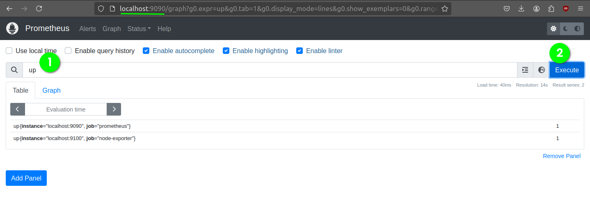

its fine, if you dont see the exact output

explore the home page

**go to status -> config:**

which shows the same contents of `prometheus.yml` file

### MONITORING LINUX HOST METRICS WITH THE NODE EXPORTER

- download node exporter from prometheus official website
- extract and move `node_exporter` file to `/usr/local/bin`
- [create a](#create-a-prometheus-servicefile) `node-exporter.service` file using following data

``` service
[Unit]
Description=Prometheus node exporter Service
After=network.target

[Service]
Type=simple
ExecStart=/usr/local/bin/node_exporter 

[Install]
WantedBy=multi-user.target
```
start a service:

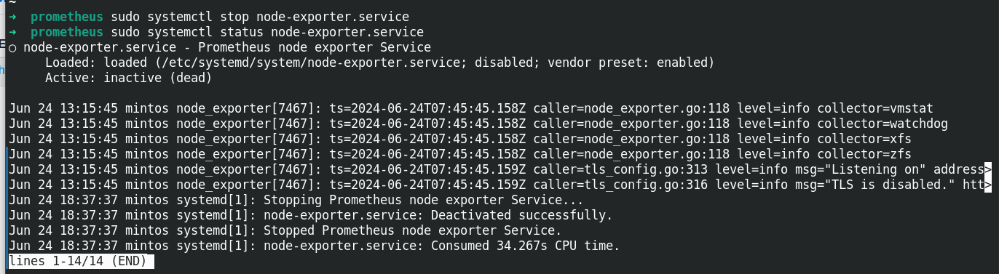

after above step, check http://localhost:9100

edit `prometheus.yml` file with this:

#dont edit rule_files:

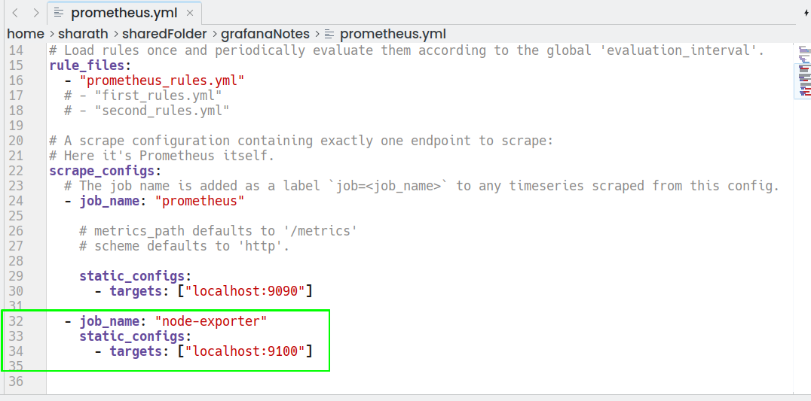

### next, restart prometheus service:

``` shell
sudo systemctl restart prometheus.service
```

in the ui check for node exporter servie: status-> services

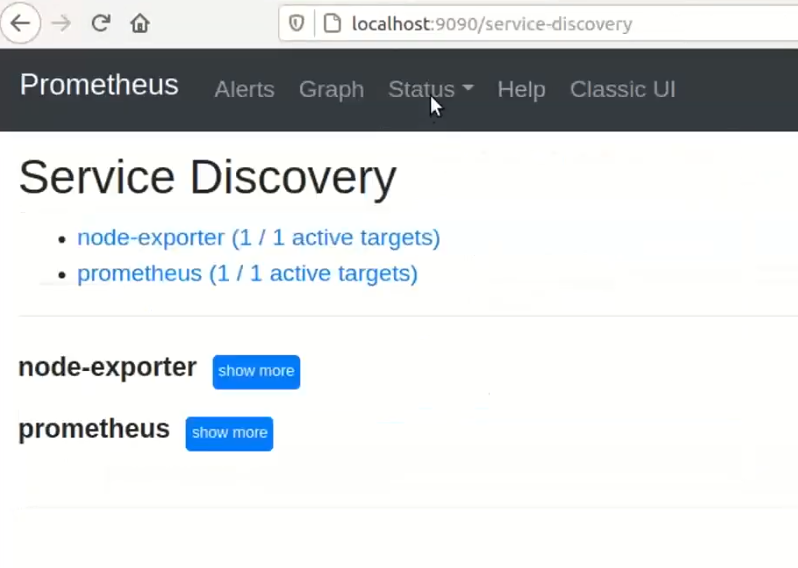

#### execute queries

**expression:**

irate(prometheus_http_request_duration_seconds_count{job="prometheus"}[5m])


**total number of requests handled in last hour:**

increase(prometheus_http_request_duration_seconds_count{job="prometheus"}[1h])

**used memory:**

(100*node_memory_MemFree_bytes/node_memory_MemTotal_bytes)

**unused Memory:**

100-(100*node_memory_MemFree_bytes/node_memory_MemTotal_bytes)

**check rules in command line (go inside prometheus directory and run this command)**
``` shell
cd /usr/local/bin/prometheus
```
``` shell
touch prometheus_rules.yml
``` 
inside `prometheus_rules.yml` data:
``` yaml
groups:
- name: custom_rules
  rules:
    - record: node_memory_MemFree_in_percent
      expr: 100-(100*node_memory_MemFree_bytes/node_memory_MemTotal_bytes)
``` 
check rules (inside `/usr/local/bin/prometheus`):

``` shell
./promtool check rules prometheus_rules.yml
```

above command **must** return success message

add rule in `prometheus.yml` file

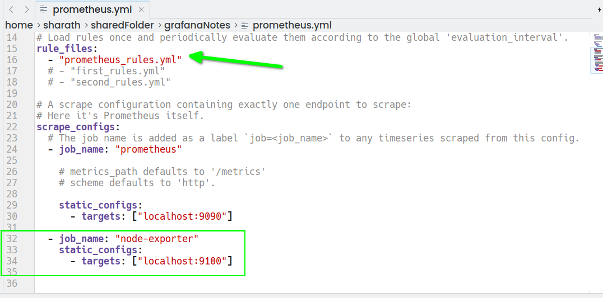

next, reload

``` shell
sudo systemctl daemon-reload
```

- next [restart](#next-restart-prometheus-service) prometheus service
- next status check of prometheus service
- next check web:
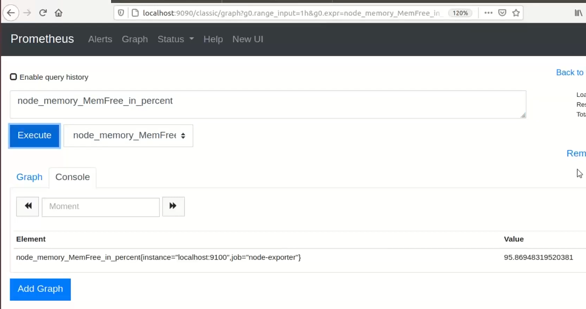
- check custom rules:
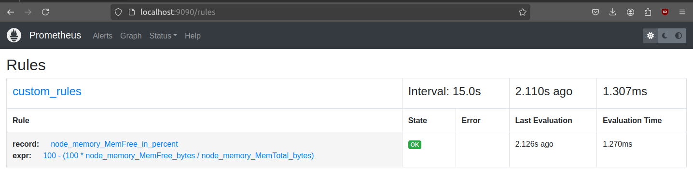

#### create alert rule

``` shell
cd /usr/local/bin/prometheus
```

``` shell
sudo nano prometheus_rules.yml
``` 
updated yaml file looks like this:
``` yaml
groups:
- name: custom_rules
  rules:
    - record: node_memory_MemFree_in_percent
      expr: 100-(100*node_memory_MemFree_bytes/node_memory_MemTotal_bytes)
- name: alert_rules
  rules:
    - alert: InstanceDown
      expr: up == 0
      for: 1m
      labels: 
        severity: critical
      annotations:
        summary: "Instance [{{ $labels.instance}}] is Down"
        description: "[{{ $labels.instance}}] of job [{{ $labels.job}}] is down for more than a minute"

```

check rules (inside `/usr/local/bin/prometheus`):

``` shell
./promtool check rules prometheus_rules.yml
```
above command **must** return success message

- restart prometheus service
- check status of prometheus service
- check the web
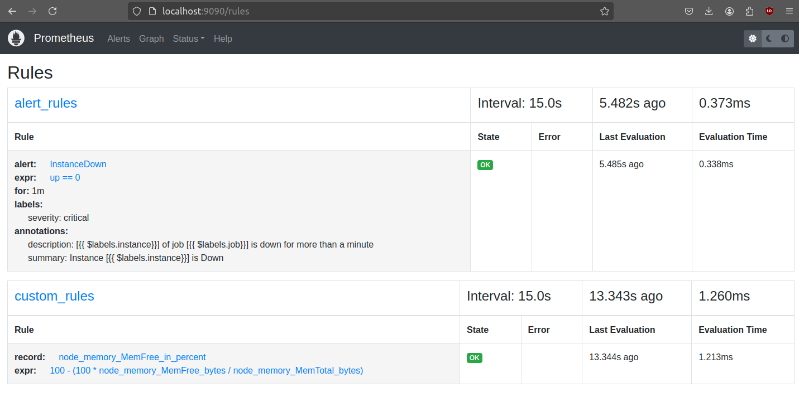
- now check

- check alerts
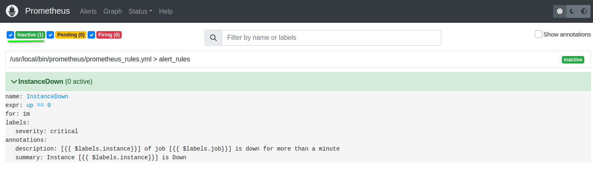

#### install alert Manager from prometheus web
- download -> untar -> copy recursively `alertmanager` folder to `/usr/local/bin`
- craete `alert_manager.service` file in `/etc/systemd/system/`
``` service
[Unit]
Description=prometheus alert manager Service
After=network.target

[Service]
Type=simple
ExecStart=/usr/local/bin/alertManager/alertmanager --config.file=/usr/local/bin/alertManager/alertmanager.yml

[Install]
WantedBy=multi-user.target
```
``` shell
cd /usr/local/bin/alertmanager
```
update `alertmanager.yml` file

``` yaml
global:
  resolve_timeout: 5m

route:
  group_by: [Alertname]
  group_interval: 30s
  repeat_interval: 30s
  receiver: email-me
receivers:
- name: email-me
  email_configs:
  - send_resolved: true
    to: reciever@protonmail.com
    from: user@gmail.com
    smarthost: smtp.gmail.com:587
    auth_username: "user@gmail.com"
    auth_identity: "user@gmail.com"
    auth_password: "app passwd"

inhibit_rules:
  - source_match:
      severity: 'critical'
    target_match:
      severity: 'warning'
    equal: ['alertname', 'dev', 'instance']
```
inside alert manager check 

``` shell
./amtool check-config alertmanager.yml
```
**must** return success msg
 
 start alert manager service:
 ``` shell
 sudo systemctl start alert_manager.service
 ```
 check status of `alert_manager.service`

 check http://localhost:9093 
 
 update `prometheus.yml`

 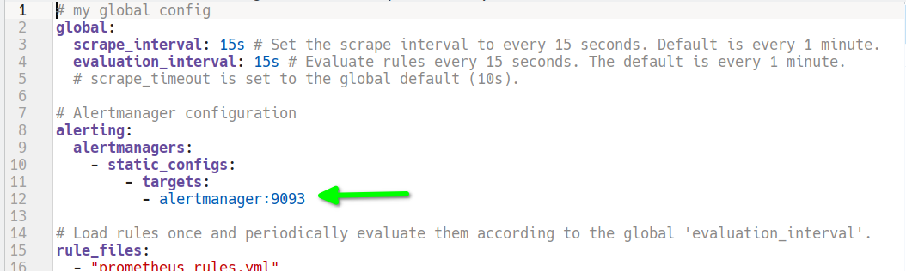

- restart prometheus service
- check status of prometheus service
- check the web for status
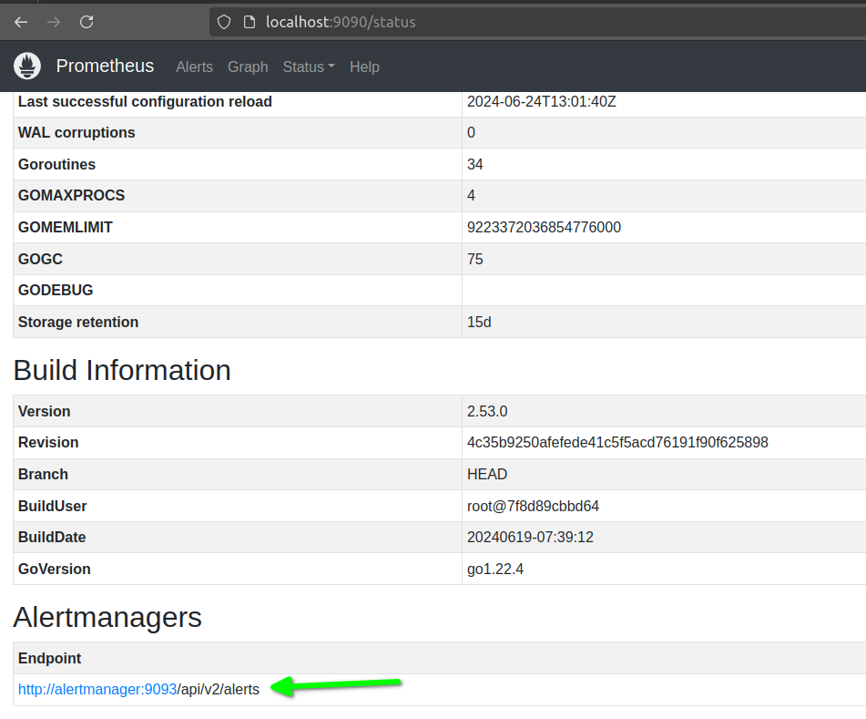
- check status of targets:
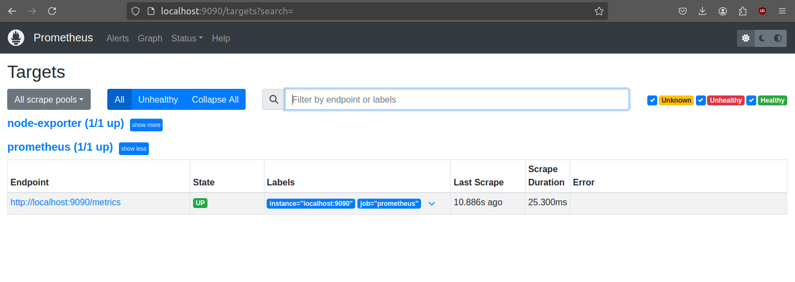
- see the alerts
- do this:
``` shell
sudo systemctl stop node-exporter.service
```
- check the status of `node-exporter.service`
- check targets:
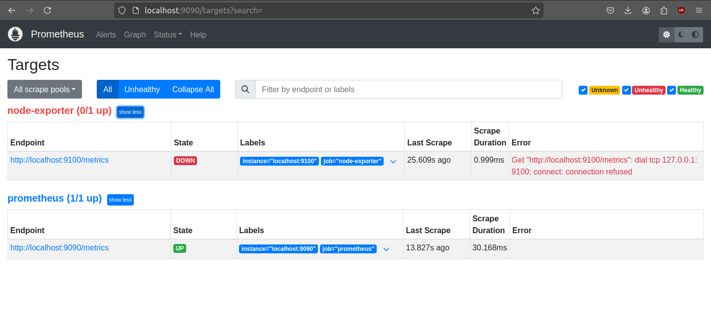
- execute **up** Query:
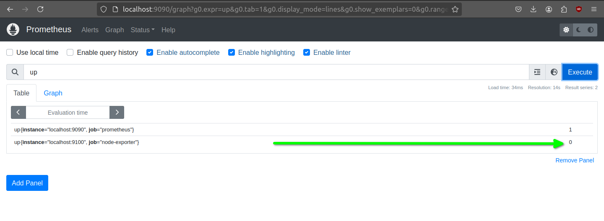
- check alerts:
<table>
<tr>
<td>

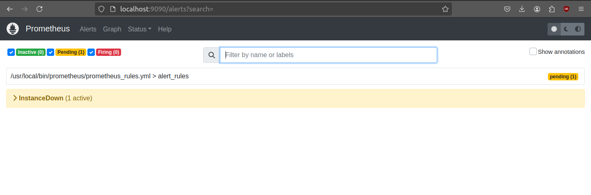
</td>
<td>

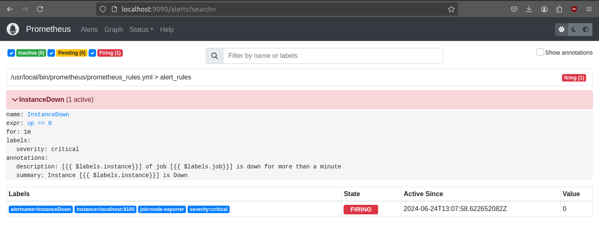
</td>
</tr>
</table>


### using Grafana
- install grafana from grafana website
- start `node-exporter` service
- start `grafana-server` service
- check status of `grafana-server`
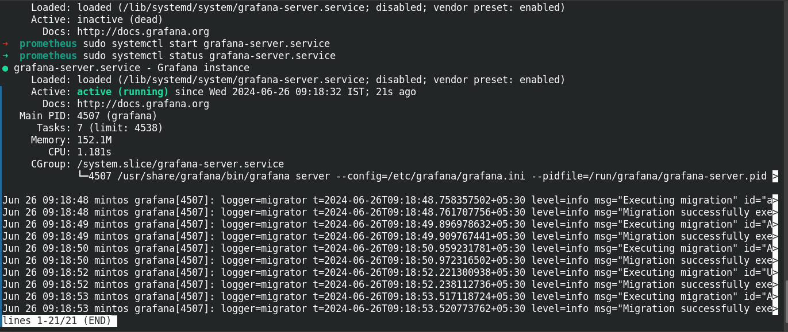
- go to http://localhost:3000
- defalut `userID:` admin `passwd:`admin

#### add Data source
- in home page -> expand connection -> data source
- add prometheus
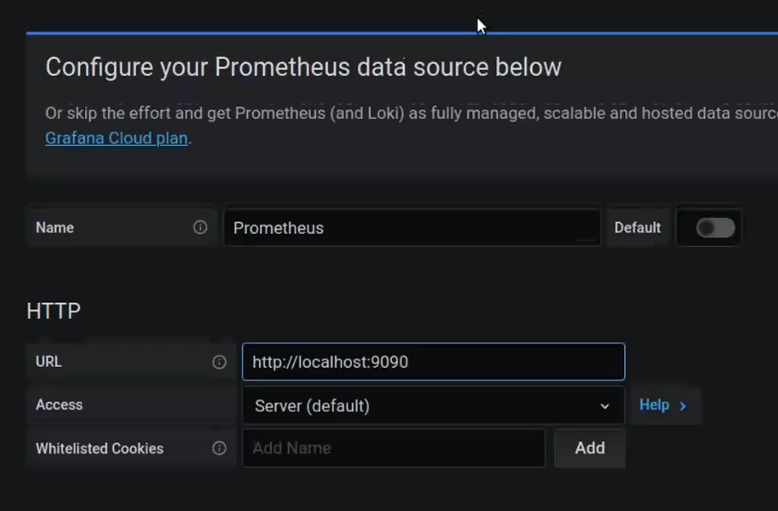
- next click on -> save and test

#### add dashboards
- from home page, click on dashboard
- import dashboard, in new tab -> google on grafana node exporter -> find this:
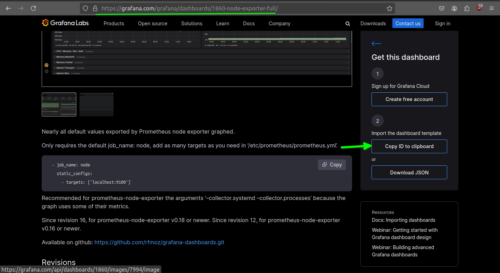
- `load from Id` -> paste the ID No :
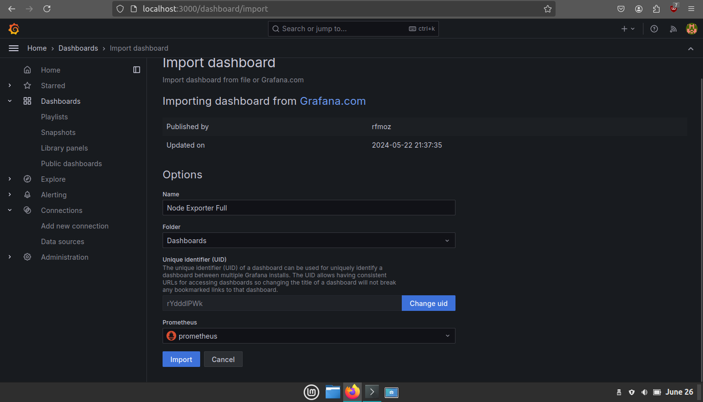
- click import
- then you will see dashboard like this:
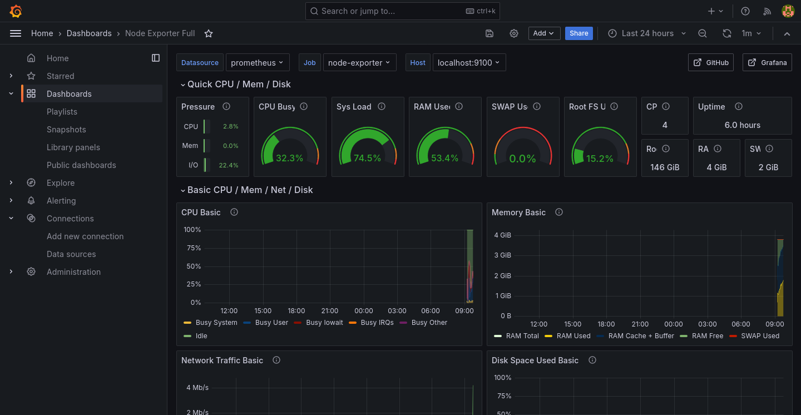
full Img:

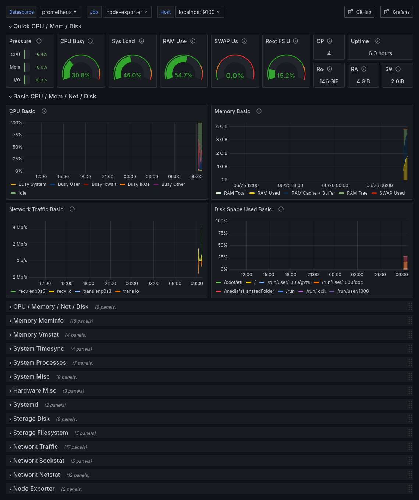


