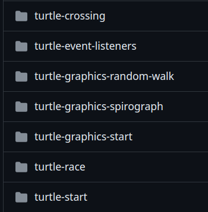
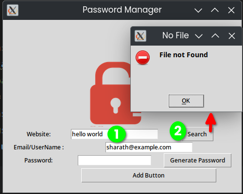
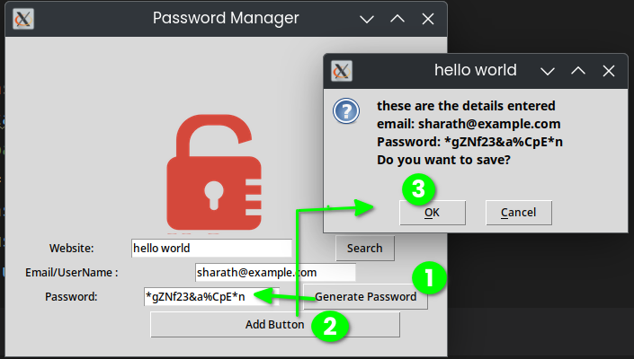
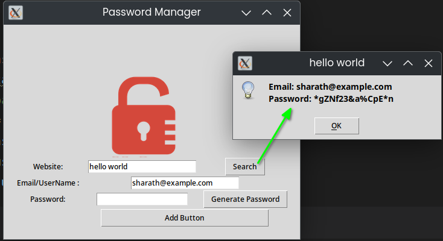
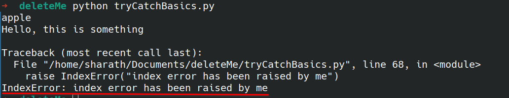
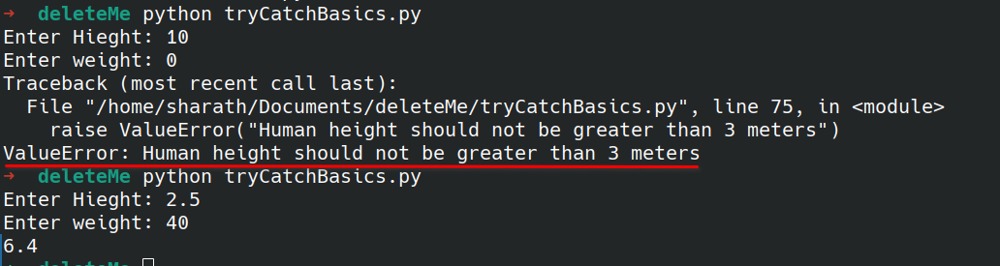

- work on logical operation
   - treasure island #
- work on loops, functions
   - [caesar-cipher-1-start](https://github.com/Sharath44665/pythonWorkSpace/tree/main/caesar-cipher-1-start)
- work on dictionary 
   - [auction bidding game](#https://github.com/Sharath44665/pythonWorkSpace/tree/main/caesar-cipher-1-start)
   - [Guess the number](https://github.com/Sharath44665/pythonWorkSpace/tree/main/guess-the-number)

- Work on Class and OOPs 
   - [coffee Machine](https://github.com/Sharath44665/pythonWorkSpace/tree/main/coffee-machine-start) 
   - [Quiz game](https://github.com/Sharath44665/pythonWorkSpace/tree/main/quiz-game-start)

- Work on GUI

    

   - [hirst painting](https://github.com/Sharath44665/pythonWorkSpace/tree/main/hirst-painting)
   - [snake game](https://github.com/Sharath44665/pythonWorkSpace/tree/main/snake-game-better)
   - [pong game](https://github.com/Sharath44665/pythonWorkSpace/tree/main/pong_game) # in linux this game have some problems

- Files
   - [mail merge](https://github.com/Sharath44665/pythonWorkSpace/tree/main/mail-merge)
   - Reading a file

``` py
with open("./Input/Letters/starting_letter.txt") as letterFile:
    # returns the first line
    content = letterFile.readline()
    # returns rest, with list with its content
    fullContent = letterFile.readlines()
```

- pandas
   - [reading csv data](https://github.com/Sharath44665/pythonWorkSpace/tree/main/reading-csv-data)
   - [squirrel census data](https://github.com/Sharath44665/pythonWorkSpace/tree/main/squirrel-census-data)
   - [us state game](https://github.com/Sharath44665/pythonWorkSpace/tree/main/us-states-games)

``` py
import pandas
csvData = pandas.read_csv("weather_data.csv")
```

- list comprehension
   -  [NATO alphabet](https://github.com/Sharath44665/pythonWorkSpace/tree/main/NATO-alphabet)

``` py
myList = [1,2,3]
newList = [n+1 for n in myList]
print(newList) # [2, 3, 4]

name = "Sharath"
newName = [letter for letter in name ]
print(newName) # ['S', 'h', 'a', 'r', 'a', 't', 'h']


doubleList = [val*2 for val in range(1,5)]
print(doubleList) # [2, 4, 6, 8]

print("squaring list:")
squareList = [val*val for val in range(1,6)]
print(squareList) 


names = ["Ada", "Remy", "Kylen", "Alex", "Tristan", "Lian", "Jayleen","Trace"]
# generate a list containing less than or equal to 4 letters of names
namesOf4char = [newName for newName in names if len(newName) < 5]
print(namesOf4char) # ['Ada', 'Remy', 'Alex', 'Lian']
```

[Screencast_20240509_171612.webm](https://github.com/Sharath44665/notes/assets/66732823/902f0e38-1bfa-4548-b586-cf7ce76a48bc)


- args, kwargs
   - [tkinter basics](https://github.com/Sharath44665/pythonWorkSpace/tree/main/basics-tkinter)
   - [miles to km project](https://github.com/Sharath44665/pythonWorkSpace/tree/main/miles-to-km-converter)


``` py
# args:

def add(*args):
    sum = 0
    for val in args:
        sum += val

    print(sum)

add(3,4,10) # 17

# -------------------------
# kwargs:

def calculate(**kwargs): # kwargs = Key Word Arguments
    # print(kwargs) # {'add': [1, 2], 'multiply': (2, 3, 4)}
    sum = 0
    answer = 1
    for key,value in kwargs.items():

        if key == "add":
            for val in value:
                sum += val

        if key == "multiply":
            for val in value:
                answer *= val
    return [sum, answer]

answer = calculate(add= [1,2])
print(answer) # [3,1] = [sum, answer]
answer = calculate(multiply= [1,2])
print(answer) # [0,2] = = [sum, answer]

# ----------
# excercise

class Car:
    def __init__(self, **kwargs):
        self.color = kwargs.get("color")  # getting from dictionary
        self.model = kwargs.get("model")  # if you dont pass model, then it will return None


carOne = Car(color="blue", model="audi")
print(carOne.color) # blue
print(carOne.model) # audi
carTwo = Car(model="innova")
print(carTwo.color) # None
print(carTwo.model) # innova
```
- pomodoro game
  
[Screencast_20240509_201943.webm](https://github.com/Sharath44665/notes/assets/66732823/a8da7fdc-f42f-4a9c-a8c6-23db9e395e9c)

- password manager

| 1  | 2  |
| --- | --- |
| 3  | No img |

- try catch basics:

``` py
try:
    with open("some.txt") as myFile:
        myFile.read()
except:
    print("something went wrong")

# something went wrong

try:
    with open("data.txt") as dataFile:
        pass
    mydict ={"a": "apple"}
    print(mydict["b"])
except FileNotFoundError: # if no file, create file
    print("file not found, so file is created") 
    with open("data.txt", mode="w") as myFile:
        pass
except KeyError: # if no key found, print the following
    print("Hey that key not found")

# ---- important ---
try:
    with open("data.txt") as dataFile:
        pass
    mydict ={"a": "apple"}
    print(mydict["b"])
    print(mydict["a"])
except FileNotFoundError:
    print("file not found, so file is created")
    with open("data.txt", mode="w") as myFile:
        myFile.write("Hello, this is something")
        pass
except KeyError as errorMsg: # errorMsg is not key word, its just a variable, can name anything you want
    print(f"Hey, that key: {errorMsg} not found") # Hey, that key: 'b' not found

else: # optional
    # if there is exception following code NOT WORK
    # if there is no exceptions following code will execute
    with open("data.txt") as myFile:
        content = myFile.read()
        print(content)

finally: # optional, prints the following no matter what
    print("this prints finally")
```

``` py
# raise exception example 1
try:
    with open("data.txt") as dataFile:
        pass
    mydict = {"a": "apple"}
    # print(mydict["b"])
    print(mydict["a"])
except FileNotFoundError:
    print("file not found, so file is created")
    with open("data.txt", mode="w") as myFile:
        myFile.write("Hello, this is something")
        pass
except KeyError as errorMsg:  # errorMsg is not key word, its just a variable, can name anything you want
    print(f"Hey, that key: {errorMsg} not found")

else:  # optional
    # if there is exception following code not work
    # if there is no exceptions following code will execute
    with open("data.txt") as myFile:
        content = myFile.read()
        print(content)

finally:  # optional
    # print("this prints finally")
    raise IndexError("index error has been raised by me") 
```

output:



``` py
# raise exception example 2
height = float(input("Enter Hieght: "))
weight = int(input("Enter weight: "))

if height >3:
    raise ValueError("Human height should not be greater than 3 meters")
bmi = weight/(height*height)
print(bmi)
```
output



- sending email
   - [birthday wisher](https://github.com/Sharath44665/pythonWorkSpace/tree/main/birthday-wisher-hard)

``` py
import smtplib

myEmail = "user@noreply.com"
receiver = "reciever@noreply.me"
appPasswd =input("enter your app passwd: ")


message = """Subject: Hi there, Sample python mail

    
Please note that this code is just a sample and you may need to modify it according to your specific use case.
This message is sent from Python."""

with smtplib.SMTP(host="smtp.gmail.com",port=587) as myConnection:
    myConnection.starttls() # creates a secure connection TLS
    myConnection.login(user=myEmail,password=appPasswd)
    myConnection.sendmail(from_addr=myEmail, to_addrs=receiver, msg=message)

print("done")
```

- working with DateTime
``` py
import  datetime as myDate

now = myDate.datetime.now()
print(now)  # 2023-10-30 19:14:29.839610
year = now.year
day = now.day
month = now.month
weekDay = now.weekday()
print(day)
print(month)
print(weekDay)  # 0 - monday, 1 - tuesday, 2 - wednesday ....
print(year)
if year == 2023:
    print("hello world")

dateOfBirth = myDate.datetime(year=1995, month=10, day=25)
print(dateOfBirth)  # 1995-10-25 00:00:00
```

- API calls
   - [kanye quotes](https://github.com/Sharath44665/pythonWorkSpace/tree/main/kanye-quotes-start)
   - [iss (international space statioin) over head](https://github.com/Sharath44665/pythonWorkSpace/tree/main/Solution_issoverhead)
   - [quizzler app](https://github.com/Sharath44665/pythonWorkSpace/tree/main/quizzler-app-start)
   - [rain alert - send sms](https://github.com/Sharath44665/pythonWorkSpace/tree/main/rain-alert)
   - [stock news - sms notificaiton](https://github.com/Sharath44665/pythonWorkSpace/tree/main/stock-news)
   - [make request post Method using API](https://github.com/Sharath44665/pythonWorkSpace/tree/main/habit-traker)
   - [tracking using google sheets](https://github.com/Sharath44665/pythonWorkSpace/tree/main/tracking-using-googleSheets)
   - [search and find cheapest flight deals](https://github.com/Sharath44665/pythonWorkSpace/tree/main/flight-deals) # attach screenshot
   - [spotify + top hot 100 bill board](https://github.com/Sharath44665/webDevelopment/tree/main/billboard-hot-100) # webscraping + api
   - [automated amazon price tracker](https://github.com/Sharath44665/webDevelopment/tree/main/automated-amazon-price-tracker) # webscraping + api
   


``` py
import requests
import datetime as dt

MY_LATITUDE = 13.340881
MY_LONGITUDE = 74.742142
# response=requests.get("http://api.open-notify.org/iss-now.json")
# response.raise_for_status()
# # print(response)
#
# data=response.json()
# # print(data)
# longitude =data["iss_position"]["longitude"]
# latitude=data["iss_position"]["latitude"]
#
# iss_position=(latitude,longitude)
# print(iss_position)

# this is required for https://api.sunrise-sunset.org/json
parameters = {
    "lat": MY_LATITUDE,
    "lng": MY_LONGITUDE,
    "formatted": 0,
}
response = requests.get("https://api.sunrise-sunset.org/json", params=parameters)
response.raise_for_status()
data = response.json()

sunrise = data["results"]["sunrise"].split("T")[1].split(":")[0]
sunset = data["results"]["sunset"].split("T")[1].split(":")[0]
# print(data)
# print(sunrise.split("T")[1].split(":")[0])
timeNow = dt.datetime.now()
print(sunrise)
print(sunset)
print(timeNow.hour) 
```
- WebDevelopment
   - [Motivation meme project](https://github.com/Sharath44665/webDevelopment/tree/main/6.4%20Motivation%20Meme%20Project)
   - [100 Movies must watch web Scraping](https://github.com/Sharath44665/webDevelopment/tree/main/100-movies-to-watch-web-scraping) # BeautifulSoup

- Selenium
   - [basics](https://github.com/Sharath44665/pythonWorkSpace/tree/main/selenium-basics)
   - [selenium extract events](https://github.com/Sharath44665/pythonWorkSpace/tree/main/selenium-extract-events-website)
   - [speed twitter complaint - post something](https://github.com/Sharath44665/pythonWorkSpace/tree/main/speed-twitter-complaint-bot)
   - [instagram follower bot](https://github.com/Sharath44665/pythonWorkSpace/tree/main/instagram-follower-bot)

- flask project
   - work on decorators
   - [hello flask](https://github.com/Sharath44665/pythonWorkSpace/tree/main/hello-flask)
   - [advaced decorators(args, kwargs)](https://github.com/Sharath44665/pythonWorkSpace/tree/main/advanced-decorators)
   - [higher lower](https://github.com/Sharath44665/pythonWorkSpace/tree/main/higher-lower-flask)
   - [rendering template html and static file](https://github.com/Sharath44665/pythonWorkSpace/tree/main/my-personal-site-flask)


``` py
# work on decorators
import time

def delayDecorator(function):

    def wrapperFunction():
        time.sleep(2)
        # do something before
        function()
        # do something after
        function()

    return wrapperFunction

@delayDecorator
def sayHello():
    print("Hello")

@delayDecorator
def sayBye():
    print("Bye")

def sayGreetings():
    print("How are you?")

# sayHello() # executes after 2 seconds
# sayGreetings() # executes immediately

decoratedFunction = delayDecorator(sayGreetings) # applying decorator to the function sayGreetings()
print(decoratedFunction) # <function delayDecorator.<locals>.wrapperFunction at 0x7d78346dcfe0>
decoratedFunction() # executes after 2 seconds with output 2 times of function
```