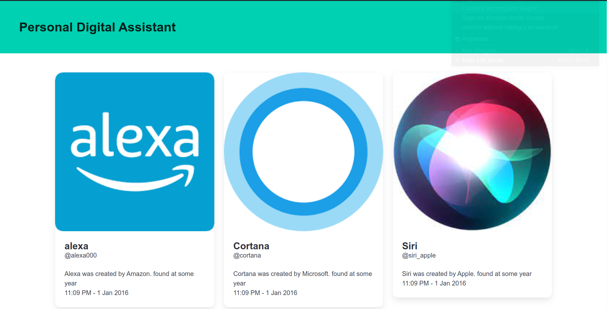
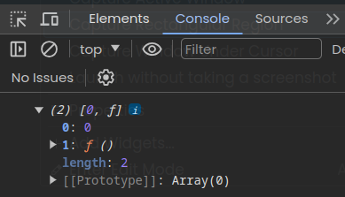
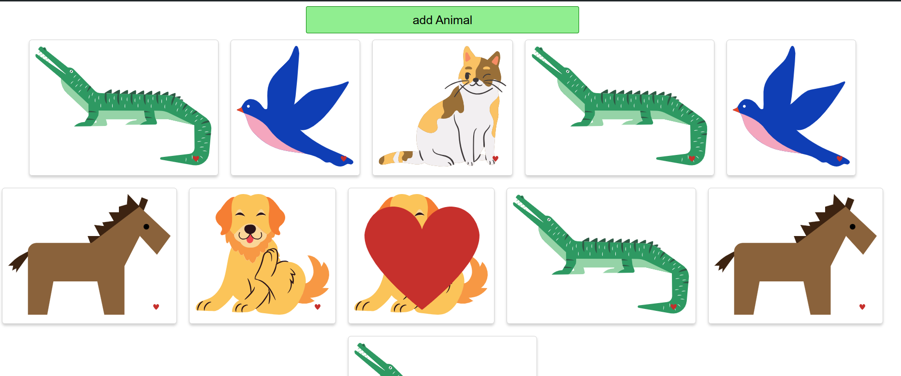

starting: 

1. [Hello world](https://github.com/Sharath44665/react_workspace/tree/main/hello_world)
2. show components.
   - [show date](https://github.com/Sharath44665/react_workspace/tree/main/show_date)
   - [guide lines](https://github.com/Sharath44665/react_workspace/tree/main/guide_lines) 
   - [community guide](https://github.com/Sharath44665/react_workspace/tree/main/community_guide) 
3. create [personal digital assistant](https://github.com/Sharath44665/reactWorkspace/tree/main/03personal_digital_assistant) project:
    
   - working on bulma css framework
   - working on props (properties)
   - exporting js

4. create animals project:
    - [work on events](https://github.com/Sharath44665/react_workspace/tree/main/work_on_event)
    - [work on states](https://github.com/Sharath44665/react_workspace/tree/main/work_on_use_state) 

        ``` js
        console.log(useState(0));
        ```

        
    - [work on animals project](https://github.com/Sharath44665/reactWorkspace/tree/main/04animals)

       

5. Search images using unsplash api
   - [install axios to make api requests #see preview]() # not added link


   
  
