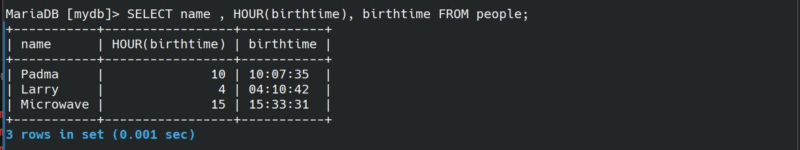
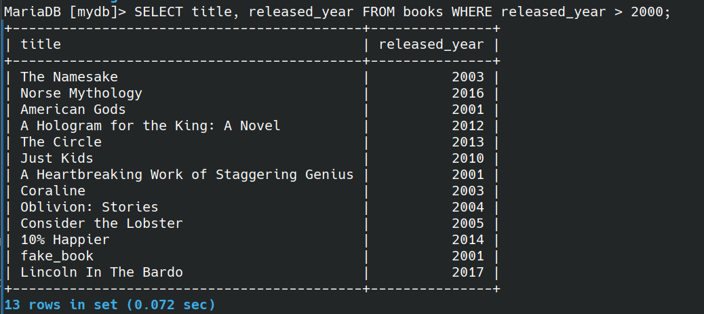

### creating Table:

``` sql
CREATE TABLE cats (
    cat_id INT NOT NULL AUTO_INCREMENT,
    name VARCHAR(100),
    age INT,
    PRIMARY KEY (cat_id)
);
```

``` sql
INSERT INTO cats(name, age)
VALUES('Charlie', 17);

INSERT INTO cats(name, age)
VALUES('Connie', 10);

SELECT * FROM cats;
```


### Run a file
``` sql
source file_name.sql
```
### working with Concat
```sql
SELECT CONCAT("Hello", "World") 
```
output:


``` sql
select author_fname, author_lname FROM books;
```
output:


``` sql
SELECT CONCAT(author_fname, " ", author_lname) FROM books; 
```

output:


#### fancy heading
``` sql
SELECT CONCAT(author_fname, " ", author_lname) AS 'Full name' FROM books; 
```

output:


``` sql
SELECT author_fname AS first, 
	author_lname AS last, 
	CONCAT(author_fname, " ", author_lname) AS 'Full name' FROM books;
```

output:


#### CONCAT_WS:
``` sql
SELECT CONCAT_WS(" - ",title,author_fname,author_lname) AS 'Title - first - last' FROM books;
```

output:


### working on SUBSTRING or SUBSTR

``` sql
SELECT SUBSTRING('Hello world ', 1, 4 ) AS demo;
```

output:


``` sql
SELECT SUBSTRING('Hello world ', 7) AS demo;
```


``` sql
SELECT SUBSTRING('Hello world ', -3) AS demo;
```


``` sql
SELECT SUBSTRING(title, 1, 10) AS 'Substring of title' FROM books;
```

O/p:


``` sql
SELECT CONCAT(
	SUBSTRING(title, 1, 10),
	"...") AS 'Short title' FROM books;
```

O/p:


### working with REPLACE
 -  case sensitive

``` sql
SELECT REPLACE("Hello world", "Hell", "abcd") AS demo;
```


``` sql
SELECT REPLACE("Hello world", "l", "8") AS demo;
```


``` sql
SELECT REPLACE("cheese bread coffee milk", " ", " and ") AS demo;
```


``` sql
SELECT REPLACE(title, "e", "3") AS 'title Replace e with 3' FROM books;
``` 


### woring with REVERSE
``` sql
SELECT REVERSE('Hello World') AS demo;
``` 


### woring with CHAR_LENGTH

``` sql
SELECT CHAR_LENGTH('Hello world') AS demo;
```


``` sql
SELECT title, CHAR_LENGTH(title) AS 'Title length' FROM books;

```


### working with UPPER, LOWER

``` sql
SELECT UPPER('hello World') as demo;
```


``` sql
SELECT LOWER('hello World') as demo;
``` 


***

### working with DISTINCT

``` sql
SELECT DISTINCT author_lname FROM books;
``` 


``` sql
SELECT DISTINCT CONCAT(author_fname , " ", author_lname ) as FullName FROM books;
```


``` sql
MariaDB [mydb]> SELECT DISTINCT author_fname, author_lname FROM books;
``` 


### Sorting ORDER BY
- works on numbers
- works on strings
``` sql
SELECT author_lname FROM books ORDER BY author_lname;
``` 
> above one is ascending order by default


``` sql
SELECT author_lname FROM books ORDER BY author_lname DESC;
``` 
> Descending order


``` sql
SELECT title, pages , released_year FROM books ORDER BY released_year ;
``` 


**please Note** that, you can avoid using **released_year**  in SELECT => which works totally fine.

``` sql
SELECT title, pages FROM books ORDER BY released_year ;
``` 

``` sql
SELECT title, pages , released_year FROM books ORDER BY 3 ;
```

see the pic below


#### at ORDER BY you can add two or more columns.

``` sql
SELECT author_fname , author_lname FROM books ORDER BY author_fname , author_lname ;
``` 


### Using LIMIT
``` sql
SELECT title FROM books LIMIT 3;
``` 


get 5 latest released books:

``` sql
SELECT title, released_year FROM books ORDER BY released_year DESC LIMIT 5;
``` 
or

``` sql
SELECT title, released_year FROM books ORDER BY released_year DESC LIMIT 0, 5;
``` 


### Better searches using LIKE

get books having author name 'da'?

``` sql
SELECT title, author_fname FROM books WHERE author_fname LIKE '%da%';
``` 


get books **starting** author name from 'da'?

``` sql
SELECT title, author_fname FROM books WHERE author_fname LIKE 'da%';
``` 


get the quatity having 4 charecters/digits?

``` sql
SELECT title , stock_quantity FROM books WHERE stock_quantity LIKE "____";
``` 


search for books having title "%" symbol

or

search for books having title "%" symbol

see below.

``` sql
SELECT title, pages FROM books WHERE title LIKE '%\%%';
```


``` sql
SELECT title, pages FROM books WHERE title LIKE '%\_%';
```


### Aggregate Functions

### COUNT

How many books in the table?

``` sql
SELECT count(*) from books;
``` 


``` sql
SELECT count(DISTINCT author_fname ) FROM books;
```


Display total number of unique authors

``` sql
SELECT COUNT(DISTINCT author_lname , author_fname ) FROM books;
``` 


How many titles contain "the"?

``` sql
SELECT COUNT(*) FROM books WHERE title LIKE '%the%';
``` 


``` sql
SELECT title, author_lname FROM books GROUP BY author_lname ;
```


the above image is grouped like this:


``` sql
SELECT author_lname, COUNT(*) FROM books GROUP BY author_lname ;
``` 


``` sql
-- try this code also;
SELECT author_fname , author_lname , COUNT(*) FROM books GROUP BY author_fname , author_lname ;
```

get the count of books that released in respective year:

``` sql
SELECT released_year , COUNT(*) FROM books GROUP BY released_year ;
```

### using MIN and MAX

Get minimum pages in the books

``` sql
SELECT MIN(pages ) FROM books;
```


// respectively MAX works for highest values

### SubQuery

**Q**: What if i want the title of the longest Book?

``` sql
SELECT title , pages FROM books WHERE pages = (SELECT  MAX(pages) FROM books);
```

OR 

``` sql
SELECT title, pages FROM books ORDER BY pages DESC LIMIT 1;
```


**Q**: Name the book having longest title?

### MIN and MAX using GROUP BY

**Q:** Find the year each author published their first book?

``` sql
SELECT author_fname , author_lname , MIN(released_year) AS 'first released' 
    FROM books 
    GROUP BY author_lname , author_fname ;
```


### Using SUM

``` sql
SELECT SUM(pages) FROM books;
```


Sum all page each author has written

``` sql
SELECT author_fname , author_lname , SUM(pages) AS 'total pages' FROM books GROUP BY author_fname , author_lname ;
``` 


### The AVG functions

``` sql
SELECT AVG(released_year ) FROM books;
```


**Q**: calculate the average stock quantity for books released in the same year 

``` sql
SELECT released_year , AVG( stock_quantity ) AS 'average sold'  FROM books GROUP BY released_year ;
``` 


Q: print the number of books in the database?

Q: print out how many books released in each year?

Q: print out the total number of books in stock? 

Q: find the average released year by each author?

Q: find the full name of author who wrote a longest book?

Q: print this:

&nbsp;&nbsp;&nbsp;&nbsp;&nbsp;&nbsp;&nbsp;&nbsp;&nbsp;&nbsp;&nbsp;&nbsp;&nbsp;&nbsp; 

solution:

``` sql
-- print the number of books in the database?
SELECT COUNT(*) FROM books;

-- print out how many books released in each year?
SELECT released_year , COUNT(*) FROM books GROUP BY released_year ;

-- print out the total number of books in stock? 
SELECT SUM( stock_quantity ) AS 'Total number of books' FROM books;

-- find the average released year by each author?
SELECT CONCAT(author_fname , " ", author_lname ) AS 'Author', AVG( released_year ) FROM books GROUP BY author_lname, author_fname;

-- find the full name of author who wrote a longest book?
SELECT CONCAT(author_fname , author_lname ) AS 'Full name' , pages AS 'big book page no' FROM books WHERE pages= (SELECT MAX(pages) FROM books);

-- last question
select released_year as year , count(*) as '#books' , AVG(pages) AS 'avg pages' FROM books GROUP BY released_year ;
```

### DATE, TIME, DATETIME
- DAY()
- DAYNAME()
- DAYOFWEEK()
- DAYOFYEAR()

### Using CURDATE, CURTIME, NOW
``` sql
INSERT INTO people(name, birthdate,  birthtime,birthdt )
    VALUES('Microwave', CURDATE(), CURTIME(),NOW());
```


### Formatting DATE

[click here to check the docs](https://www.w3schools.com/sql/func_mysql_date_format.asp)
``` sql
SELECT name ,DAY(birthdate) FROM people;
```


``` sql
SELECT name ,DAYNAME(birthdate), birthdate FROM people;
```


``` sql
SELECT name ,DAYOFWEEK(birthdate), birthdate FROM people;
```


``` sql
SELECT name ,DAYOFYEAR(birthdt), birthdt FROM people;
```


``` sql
SELECT name , MONTH(birthdate), birthdate FROM people;
```


``` sql
SELECT name , MONTHNAME(birthdate), birthdate FROM people;
```


``` sql
SELECT name , HOUR(birthtime), birthtime FROM people;
```



// Using above, do same for MINUTE

**Q**: get 'april 04th 2024'

``` sql
SELECT name, CONCAT( month(birthdate), " ", DAY(birthdate),"th ", YEAR(birthdate)) AS 'new date' FROM people;
```


// other examples

``` sql
SELECT name, DATE_FORMAT(birthdt, '%W %M %Y') FROM people;

-- or 
-- SELECT name, DATE_FORMAT(birthdt, '%W-%M-%Y') FROM people;
```


``` sql
SELECT name, DATE_FORMAT(birthdt, '%D/%c/%Y'), birthdate FROM people;
```


#### DATEDIFF

``` sql
SELECT name, birthdate, DATEDIFF(NOW(), birthdt) FROM people;
```


**TIMESTAMP and DATETIME are used to store date and time values, but they have some differences**:

1. DATETIME stores the date and time value as two separate entities, with a **range of** '0000-01-01 00:00:00' to '9999-12-31 23:59:59'.

2. TIMESTAMP, on the other hand, stores both date and time as a single entity and is typically used to record the time of an event (like when a row was inserted or updated). It has a **range of** '1970-01-01 00:00:01' to '2038-01-19 03:14:07'.

3. **TIMESTAMP can be set to automatically update whenever a change is made to the row, which is not typically the case with DATETIME**.

Remember, the use of these data types can depend on the specific requirements of your database.

**Q**: display current time

**Q**: display current date

**Q**: display current day of week

**Q**: display current day Name?

``` sql
-- display current time
SELECT CURRENT_TIME();

-- display current date
SELECT CURRENT_DATE();

-- display current day of week
SELECT DAYOFWEEK(CURRENT_DATE());

-- display current day Name?
SELECT DAYNAME(CURRENT_DATE());
```

***

### NOT LIKE

Display books with title not start with 'w'

```sql
SELECT title FROM books WHERE title NOT LIKE 'w%';
```


### greter than or lesser than

- also use for greater than or equal to >=
- also use for greater than or equal to <=

``` sql
SELECT title, released_year FROM books WHERE released_year > 2000; 
```



``` sql
SELECT 99 > 1;
SELECT 99 < 1;
```


### logical AND / OR

SELECT book writtn by dave eggars, published after the year 2010

- ### AND
``` sql
SELECT title , author_fname , author_lname , released_year FROM books WHERE author_fname = 'Dave' AND author_lname = 'Eggers' AND released_year >= 2010;

-- or 

SELECT title , author_fname , author_lname , released_year FROM books WHERE author_fname = 'Dave' && author_lname = 'Eggers' && released_year >= 2010;
``` 


- ### OR

``` sql
SELECT title, author_lname , released_year FROM books WHERE author_lname= 'Eggers' OR released_year > 2010 

-- or

SELECT title, author_lname , released_year FROM books WHERE author_lname= 'Eggers' || released_year > 2010 
```


### working on BETWEEN
 - BETWEEN x AND y
 - **NOT BETWEEN** is also a thing

SELECT all books released between 2004 and 2015

``` sql
SELECT title, released_year FROM books WHERE released_year >=2004 AND released_year <=2015;

-- OR 

SELECT title , released_year FROM books WHERE released_year BETWEEN 2004 AND 2015;
```


``` sql
SELECT title , released_year FROM books WHERE released_year NOT BETWEEN 2004 AND 2015 ORDER BY released_year;
```


``` sql
SELECT CAST('2024-04-23' AS DATETIME)
```


note: retrieve dates as below code

``` sql
SELECT name, birthdt FROM people WHERE birthdt BETWEEN CAST('1980-01-01' AS DATETIME) AND CAST('2000-01-01' AS DATETIME);
``` 

Use second output:


### IN / NOT IN
``` sql
SELECT title, author_lname FROM books WHERE author_lname IN('carver', 'lahiri', 'smith');
```


