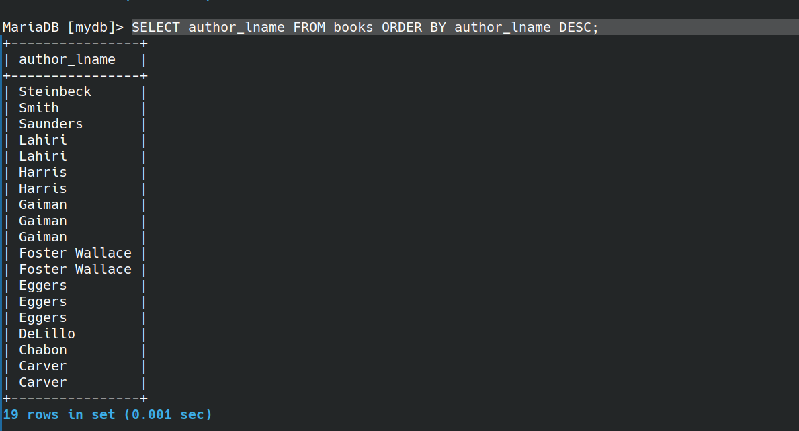

### creating Table:

``` sql
CREATE TABLE cats (
    cat_id INT NOT NULL AUTO_INCREMENT,
    name VARCHAR(100),
    age INT,
    PRIMARY KEY (cat_id)
);
```

``` sql
INSERT INTO cats(name, age)
VALUES('Charlie', 17);

INSERT INTO cats(name, age)
VALUES('Connie', 10);

SELECT * FROM cats;
```


### Run a file
``` sql
source file_name.sql
```
### working with Concat
```sql
SELECT CONCAT("Hello", "World") 
```
output:


``` sql
select author_fname, author_lname FROM books;
```
output:


``` sql
SELECT CONCAT(author_fname, " ", author_lname) FROM books; 
```

output:


#### fancy heading
``` sql
SELECT CONCAT(author_fname, " ", author_lname) AS 'Full name' FROM books; 
```

output:


``` sql
SELECT author_fname AS first, 
	author_lname AS last, 
	CONCAT(author_fname, " ", author_lname) AS 'Full name' FROM books;
```

output:


#### CONCAT_WS:
``` sql
SELECT CONCAT_WS(" - ",title,author_fname,author_lname) AS 'Title - first - last' FROM books;
```

output:


### working on SUBSTRING or SUBSTR

``` sql
SELECT SUBSTRING('Hello world ', 1, 4 ) AS demo;
```

output:


``` sql
SELECT SUBSTRING('Hello world ', 7) AS demo;
```


``` sql
SELECT SUBSTRING('Hello world ', -3) AS demo;
```


``` sql
SELECT SUBSTRING(title, 1, 10) AS 'Substring of title' FROM books;
```

O/p:


``` sql
SELECT CONCAT(
	SUBSTRING(title, 1, 10),
	"...") AS 'Short title' FROM books;
```

O/p:


### working with REPLACE
 -  case sensitive

``` sql
SELECT REPLACE("Hello world", "Hell", "abcd") AS demo;
```


``` sql
SELECT REPLACE("Hello world", "l", "8") AS demo;
```


``` sql
SELECT REPLACE("cheese bread coffee milk", " ", " and ") AS demo;
```


``` sql
SELECT REPLACE(title, "e", "3") AS 'title Replace e with 3' FROM books;
``` 


### woring with REVERSE
``` sql
SELECT REVERSE('Hello World') AS demo;
``` 


### woring with CHAR_LENGTH

``` sql
SELECT CHAR_LENGTH('Hello world') AS demo;
```


``` sql
SELECT title, CHAR_LENGTH(title) AS 'Title length' FROM books;

```


### working with UPPER, LOWER

``` sql
SELECT UPPER('hello World') as demo;
```


``` sql
SELECT LOWER('hello World') as demo;
``` 


***

### working with DISTINCT

``` sql
SELECT DISTINCT author_lname FROM books;
``` 


``` sql
SELECT DISTINCT CONCAT(author_fname , " ", author_lname ) as FullName FROM books;
```


``` sql
MariaDB [mydb]> SELECT DISTINCT author_fname, author_lname FROM books;
``` 


### Sorting ORDER BY
- works on numbers
- works on strings
``` sql
SELECT author_lname FROM books ORDER BY author_lname;
``` 
> above one is ascending order by default


``` sql
SELECT author_lname FROM books ORDER BY author_lname DESC;
``` 
> Descending order



``` sql
SELECT title, pages , released_year FROM books ORDER BY released_year ;
``` 


**please Note** that, you can avoid using **released_year**  in SELECT => which works totally fine.

``` sql
SELECT title, pages FROM books ORDER BY released_year ;
``` 

``` sql
SELECT title, pages , released_year FROM books ORDER BY 3 ;
```

see the pic below


#### at ORDER BY you can add two or more columns.

``` sql
SELECT author_fname , author_lname FROM books ORDER BY author_fname , author_lname ;
``` 


### Using LIMIT
``` sql
SELECT title FROM books LIMIT 3;
``` 


get 5 latest released books:

``` sql
SELECT title, released_year FROM books ORDER BY released_year DESC LIMIT 5;
``` 
or

``` sql
SELECT title, released_year FROM books ORDER BY released_year DESC LIMIT 0, 5;
``` 


### Better searches using LIKE

get books having author name 'da'?

``` sql
SELECT title, author_fname FROM books WHERE author_fname LIKE '%da%';
``` 


get books **starting** author name from 'da'?

``` sql
SELECT title, author_fname FROM books WHERE author_fname LIKE 'da%';
``` 


get the quatity having 4 charecters/digits?

``` sql
SELECT title , stock_quantity FROM books WHERE stock_quantity LIKE "____";
``` 


search for books having title "%" symbol

or

search for books having title "%" symbol

see below.

``` sql
SELECT title, pages FROM books WHERE title LIKE '%\%%';
```


``` sql
SELECT title, pages FROM books WHERE title LIKE '%\_%';
```


## Aggregate Functions
### COUNT

How many books in the table?

``` sql
SELECT count(*) from books;
``` 


``` sql
SELECT count(DISTINCT author_fname ) FROM books;
```


Display total number of unique authors

``` sql
SELECT COUNT(DISTINCT author_lname , author_fname ) FROM books;
``` 


How many titles contain "the"?

``` sql
SELECT COUNT(*) FROM books WHERE title LIKE '%the%';
``` 


``` sql
SELECT title, author_lname FROM books GROUP BY author_lname ;
```


the above image is grouped like this:


