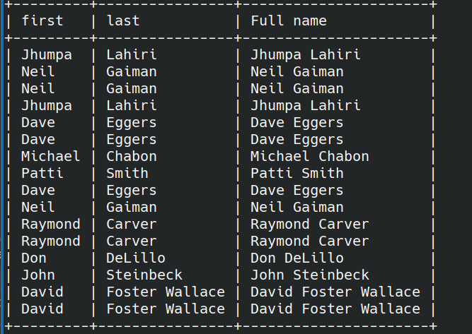
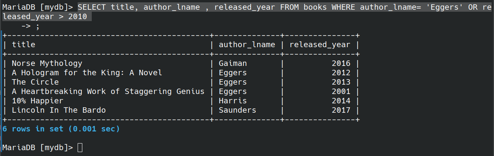
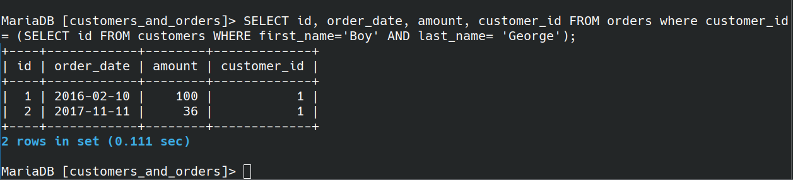
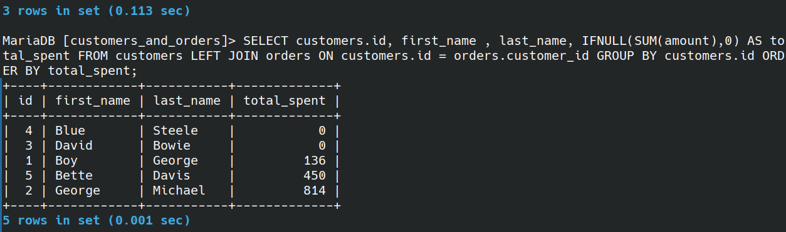
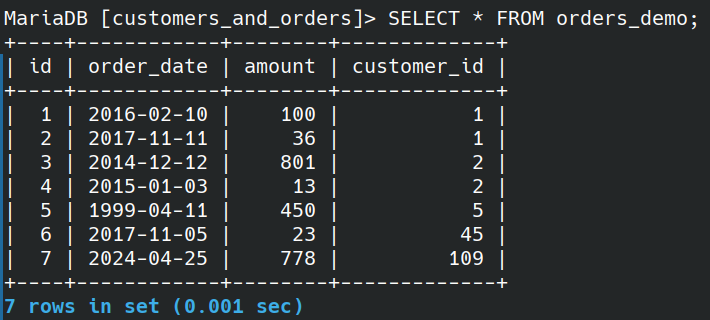
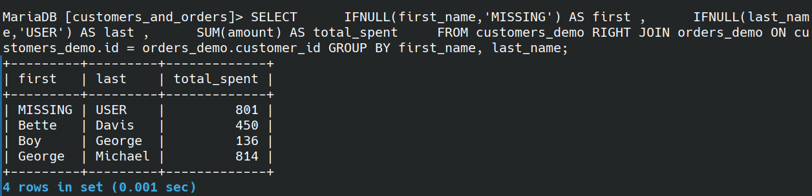

## Index
- [creating table](#creating-table)
- [how to run a sql file? ](#run-a-file)
- [working with concat](#working-with-concat)
- [working with alias/ fancy heading](#fancy-heading)
- [substrings](#working-on-substring-or-substr)
- [replacing](#working-with-replace)
- [reversing](#working-with-reverse)
- [length of charecter](#working-with-char_length)
- [UPPER, lower](#working-with-upper-lower)
- [distinct](#working-with-distinct)
- [sorting](#sorting-order-by)
- [limit](#using-limit)
- [searching, like](#better-searches-using-like)
  - [not like](#not-like)
- [aggregate functions](#aggregate-functions)
  - [count](#count)
  - [min, max](#using-min-and-max)
  - [min max group by](#min-and-max-using-group-by)
  - [sum](#using-sum)
  - [average](#the-avg-functions)
- [subquery](#subquery)
- [date time ](#date-time-datetime)
  - [curdate](#using-curdate-curtime-now)
  - [formatting date](#formatting-date)
  - [date difference](#datediff)
- [greater than, lesser than](#greter-than-or-lesser-than)
- [AND OR](#logical-and--or)
- [BETWEEN](#working-on-between)
- [type conversion using cast](#type-conversion-using-cast)
- [in not in](#in--not-in)
- [case statements](#case-statements)
- [one to many](#one-to-many)
  - [foreign key](#working-with-foreign-key)
  - [cross join](#cross-join)
  - [implicit inner join](#implicit-inner-join)
  - [explicit inner join - recommended ](#explicit-inner-join)
  - [left join](#left-join)
  - [right join](#right-join)
  - [on delete cascade](#on-delete-cascade)
- [many to many](#many-to-many)
- [having](#using-having2)

## cheat sheat


### creating Table:

``` sql
CREATE TABLE cats (
    cat_id INT NOT NULL AUTO_INCREMENT,
    name VARCHAR(100),
    age INT,
    PRIMARY KEY (cat_id)
);
```

``` sql
INSERT INTO cats(name, age)
VALUES('Charlie', 17);

INSERT INTO cats(name, age)
VALUES('Connie', 10);

SELECT * FROM cats;
```


### Run a file
``` sql
source path/to/file_name.sql
```
### working with Concat
```sql
SELECT CONCAT("Hello", "World") 
```


``` sql
select author_fname, author_lname FROM books;
```


``` sql
SELECT CONCAT(author_fname, " ", author_lname) FROM books; 
```


#### fancy heading
``` sql
SELECT CONCAT(author_fname, " ", author_lname) AS 'Full name' FROM books; 
```


``` sql
SELECT author_fname AS first, 
	author_lname AS last, 
	CONCAT(author_fname, " ", author_lname) AS 'Full name' FROM books;
```




#### CONCAT_WS:
``` sql
SELECT CONCAT_WS(" - ",title,author_fname,author_lname) AS 'Title - first - last' FROM books;
```


### working on SUBSTRING or SUBSTR

``` sql
SELECT SUBSTRING('Hello world ', 1, 4 ) AS demo;
```


``` sql
SELECT SUBSTRING('Hello world ', 7) AS demo;
```


``` sql
SELECT SUBSTRING('Hello world ', -3) AS demo;
```


``` sql
SELECT SUBSTRING(title, 1, 10) AS 'Substring of title' FROM books;
```

O/p:


``` sql
SELECT CONCAT(
	SUBSTRING(title, 1, 10),
	"...") AS 'Short title' FROM books;
```

O/p:


### working with REPLACE
 -  case sensitive

``` sql
SELECT REPLACE("Hello world", "Hell", "abcd") AS demo;
```


``` sql
SELECT REPLACE("Hello world", "l", "8") AS demo;
```


``` sql
SELECT REPLACE("cheese bread coffee milk", " ", " and ") AS demo;
```


``` sql
SELECT REPLACE(title, "e", "3") AS 'title Replace e with 3' FROM books;
``` 


### working with REVERSE
``` sql
SELECT REVERSE('Hello World') AS demo;
``` 


### working with CHAR_LENGTH

``` sql
SELECT CHAR_LENGTH('Hello world') AS demo;
```


``` sql
SELECT title, CHAR_LENGTH(title) AS 'Title length' FROM books;

```


### working with UPPER, LOWER

``` sql
SELECT UPPER('hello World') as demo;
```


``` sql
SELECT LOWER('hello World') as demo;
``` 


***

### working with DISTINCT

``` sql
SELECT DISTINCT author_lname FROM books;
``` 


``` sql
SELECT DISTINCT CONCAT(author_fname , " ", author_lname ) as FullName FROM books;
```


``` sql
MariaDB [mydb]> SELECT DISTINCT author_fname, author_lname FROM books;
``` 


### Sorting ORDER BY
- works on numbers
- works on strings
``` sql
SELECT author_lname FROM books ORDER BY author_lname;
``` 
> above one is ascending order by default


``` sql
SELECT author_lname FROM books ORDER BY author_lname DESC;
``` 
> Descending order


``` sql
SELECT title, pages , released_year FROM books ORDER BY released_year ;
``` 


**please Note** that, you can avoid using **released_year**  in SELECT => which works totally fine.

``` sql
SELECT title, pages FROM books ORDER BY released_year ;
``` 

``` sql
SELECT title, pages , released_year FROM books ORDER BY 3 ;
```

see the pic below


#### at ORDER BY you can add two or more columns.

``` sql
SELECT author_fname , author_lname FROM books ORDER BY author_fname , author_lname ;
``` 


### Using LIMIT
``` sql
SELECT title FROM books LIMIT 3;
``` 


get 5 latest released books:

``` sql
SELECT title, released_year FROM books ORDER BY released_year DESC LIMIT 5;
``` 
or

``` sql
SELECT title, released_year FROM books ORDER BY released_year DESC LIMIT 0, 5;
``` 


### Better searches using LIKE

get books having author name 'da'?

``` sql
SELECT title, author_fname FROM books WHERE author_fname LIKE '%da%';
``` 


get books **starting** author name from 'da'?

``` sql
SELECT title, author_fname FROM books WHERE author_fname LIKE 'da%';
``` 


get the quatity having 4 charecters/digits?

``` sql
SELECT title , stock_quantity FROM books WHERE stock_quantity LIKE "____";
``` 


search for books having title "%" symbol

or

search for books having title "%" symbol

see below.

``` sql
SELECT title, pages FROM books WHERE title LIKE '%\%%';
```


``` sql
SELECT title, pages FROM books WHERE title LIKE '%\_%';
```


### Aggregate Functions

### COUNT

How many books in the table?

``` sql
SELECT count(*) from books;
``` 


``` sql
SELECT count(DISTINCT author_fname ) FROM books;
```


Display total number of unique authors

``` sql
SELECT COUNT(DISTINCT author_lname , author_fname ) FROM books;
``` 


How many titles contain "the"?

``` sql
SELECT COUNT(*) FROM books WHERE title LIKE '%the%';
``` 


``` sql
SELECT title, author_lname FROM books GROUP BY author_lname ;
```


the above image is grouped like this:


``` sql
SELECT author_lname, COUNT(*) FROM books GROUP BY author_lname ;
``` 


``` sql
-- try this code also;
SELECT author_fname , author_lname , COUNT(*) FROM books GROUP BY author_fname , author_lname ;
```

get the count of books that released in respective year:

``` sql
SELECT released_year , COUNT(*) FROM books GROUP BY released_year ;
```

### using MIN and MAX

Get minimum pages in the books

``` sql
SELECT MIN(pages ) FROM books;
```


// respectively MAX works for highest values

### SubQuery

**Q**: What if i want the title of the longest Book?

``` sql
SELECT title , pages FROM books WHERE pages = (SELECT  MAX(pages) FROM books);
```

OR 

``` sql
SELECT title, pages FROM books ORDER BY pages DESC LIMIT 1;
```


**Q**: Name the book having longest title?

### MIN and MAX using GROUP BY

**Q:** Find the year each author published their first book?

``` sql
SELECT author_fname , author_lname , MIN(released_year) AS 'first released' 
    FROM books 
    GROUP BY author_lname , author_fname ;
```


### Using SUM

``` sql
SELECT SUM(pages) FROM books;
```


Sum all page each author has written

``` sql
SELECT author_fname , author_lname , SUM(pages) AS 'total pages' FROM books GROUP BY author_fname , author_lname ;
``` 


### The AVG functions

``` sql
SELECT AVG(released_year ) FROM books;
```


**Q**: calculate the average stock quantity for books released in the same year 

``` sql
SELECT released_year , AVG( stock_quantity ) AS 'average sold'  FROM books GROUP BY released_year ;
``` 


Q: print the number of books in the database?

Q: print out how many books released in each year?

Q: print out the total number of books in stock? 

Q: find the average released year by each author?

Q: find the full name of author who wrote a longest book?

Q: print this:

&nbsp;&nbsp;&nbsp;&nbsp;&nbsp;&nbsp;&nbsp;&nbsp;&nbsp;&nbsp;&nbsp;&nbsp;&nbsp;&nbsp; 

solution:

``` sql
-- print the number of books in the database?
SELECT COUNT(*) FROM books;

-- print out how many books released in each year?
SELECT released_year , COUNT(*) FROM books GROUP BY released_year ;

-- print out the total number of books in stock? 
SELECT SUM( stock_quantity ) AS 'Total number of books' FROM books;

-- find the average released year by each author?
SELECT CONCAT(author_fname , " ", author_lname ) AS 'Author', AVG( released_year ) FROM books GROUP BY author_lname, author_fname;

-- find the full name of author who wrote a longest book?
SELECT CONCAT(author_fname , author_lname ) AS 'Full name' , pages AS 'big book page no' FROM books WHERE pages= (SELECT MAX(pages) FROM books);

-- last question
select released_year as year , count(*) as '#books' , AVG(pages) AS 'avg pages' FROM books GROUP BY released_year ;
```

### DATE, TIME, DATETIME
- DAY()
- DAYNAME()
- DAYOFWEEK()
- DAYOFYEAR()

### Using CURDATE, CURTIME, NOW
``` sql
INSERT INTO people(name, birthdate,  birthtime,birthdt )
    VALUES('Microwave', CURDATE(), CURTIME(),NOW());
```


### Formatting DATE

[click here to check the docs](https://www.w3schools.com/sql/func_mysql_date_format.asp)
``` sql
SELECT name ,DAY(birthdate) FROM people;
```


``` sql
SELECT name ,DAYNAME(birthdate), birthdate FROM people;
```


``` sql
SELECT name ,DAYOFWEEK(birthdate), birthdate FROM people;
```


``` sql
SELECT name ,DAYOFYEAR(birthdt), birthdt FROM people;
```


``` sql
SELECT name , MONTH(birthdate), birthdate FROM people;
```


``` sql
SELECT name , MONTHNAME(birthdate), birthdate FROM people;
```


``` sql
SELECT name , HOUR(birthtime), birthtime FROM people;
```


// Using above, do same for MINUTE

**Q**: get 'april 04th 2024'

``` sql
SELECT name, CONCAT( month(birthdate), " ", DAY(birthdate),"th ", YEAR(birthdate)) AS 'new date' FROM people;
```


// other examples

``` sql
SELECT name, DATE_FORMAT(birthdt, '%W %M %Y') FROM people;

-- or 
-- SELECT name, DATE_FORMAT(birthdt, '%W-%M-%Y') FROM people;
```


``` sql
SELECT name, DATE_FORMAT(birthdt, '%D/%c/%Y'), birthdate FROM people;
```


### DATEDIFF

``` sql
SELECT name, birthdate, DATEDIFF(NOW(), birthdt) FROM people;
```


**TIMESTAMP and DATETIME are used to store date and time values, but they have some differences**:

1. DATETIME stores the date and time value as two separate entities, with a **range of** '0000-01-01 00:00:00' to '9999-12-31 23:59:59'.

2. TIMESTAMP, on the other hand, stores both date and time as a single entity and is typically used to record the time of an event (like when a row was inserted or updated). It has a **range of** '1970-01-01 00:00:01' to '2038-01-19 03:14:07'.

3. **TIMESTAMP can be set to automatically update whenever a change is made to the row, which is not typically the case with DATETIME**.

Remember, the use of these data types can depend on the specific requirements of your database.

**Q**: display current time

**Q**: display current date

**Q**: display current day of week

**Q**: display current day Name?

``` sql
-- display current time
SELECT CURRENT_TIME();

-- display current date
SELECT CURRENT_DATE();

-- display current day of week
SELECT DAYOFWEEK(CURRENT_DATE());

-- display current day Name?
SELECT DAYNAME(CURRENT_DATE());
```

***

### NOT LIKE

Display books with title not start with 'w'

```sql
SELECT title FROM books WHERE title NOT LIKE 'w%';
```


### greter than or lesser than

- also use for greater than or equal to >=
- also use for greater than or equal to <=

``` sql
SELECT title, released_year FROM books WHERE released_year > 2000; 
```


``` sql
SELECT 99 > 1;
SELECT 99 < 1;
```


### logical AND / OR

SELECT book writtn by dave eggars, published after the year 2010

- ### AND
``` sql
SELECT title , author_fname , author_lname , released_year FROM books WHERE author_fname = 'Dave' AND author_lname = 'Eggers' AND released_year >= 2010;

-- or 

SELECT title , author_fname , author_lname , released_year FROM books WHERE author_fname = 'Dave' && author_lname = 'Eggers' && released_year >= 2010;
``` 


- ### OR

``` sql
SELECT title, author_lname , released_year FROM books WHERE author_lname= 'Eggers' OR released_year > 2010 

-- or

SELECT title, author_lname , released_year FROM books WHERE author_lname= 'Eggers' || released_year > 2010 
```



### working on BETWEEN
 - BETWEEN x AND y
 - **NOT BETWEEN** is also a thing

SELECT all books released between 2004 and 2015

``` sql
SELECT title, released_year FROM books WHERE released_year >=2004 AND released_year <=2015;

-- OR 

SELECT title , released_year FROM books WHERE released_year BETWEEN 2004 AND 2015;
```


``` sql
SELECT title , released_year FROM books WHERE released_year NOT BETWEEN 2004 AND 2015 ORDER BY released_year;
```


### Type conversion using CAST

``` sql
SELECT CAST('2024-04-23' AS DATETIME)
```


note: retrieve dates as below code

``` sql
SELECT name, birthdt FROM people WHERE birthdt BETWEEN CAST('1980-01-01' AS DATETIME) AND CAST('2000-01-01' AS DATETIME);
``` 

Use second output:


### IN / NOT IN
``` sql
SELECT title, author_lname FROM books WHERE author_lname IN('carver', 'lahiri', 'smith');
```


### CASE statements

``` sql
SELECT title , released_year ,
    CASE
    WHEN released_year >= 2000 THEN 'Modern Lit'
    ELSE '20th Century Lit'
    END AS 'Genre'
    FROM books;
```


``` sql
SELECT title , stock_quantity ,
    CASE
    WHEN stock_quantity < 50 THEN '*'
    WHEN stock_quantity < 100 THEN '**'
    ELSE '***'
    END AS 'stock stars'
    FROM books;

-- or

SELECT title , stock_quantity ,
    CASE
    WHEN stock_quantity BETWEEN 0 AND 50 THEN '*'
    WHEN stock_quantity BETWEEN 51 AND 100 THEN '**'
    ELSE '***'
    END AS 'stock stars'
    FROM books;
```


q: Select all books written before 1980 (not inclusive)

q: select all books written by Eggers or Chabon

Q: select all books written by Lahiri, published after 2000

Q: select all books with page count between 100 and 200

Q: select all books where author_lname starts with a 'c' or 's'

q: if title contains 'stories' -> Short stories

&nbsp;&nbsp;&nbsp;&nbsp;&nbsp;&nbsp;&nbsp;&nbsp;&nbsp;&nbsp;&nbsp;&nbsp;just kids  and heartbreaking work -> Memoir

&nbsp;&nbsp;&nbsp;&nbsp;&nbsp;&nbsp;&nbsp;&nbsp;&nbsp;&nbsp;&nbsp;&nbsp;Everything else -> Novel

**q**: make this happen:


``` sql
-- Select all books written before 1980 (not inclusive)
SELECT title , released_year FROM books WHERE released_year < 1980;

-- select all books written by Eggers or Chabon
SELECT title , author_lname FROM books WHERE author_lname = 'Eggers' OR author_lname = 'Chabon';

-- or

SELECT title , author_lname FROM books WHERE author_lname IN ('Eggers','Chabon');

-- select all books written by Lahiri, published after 2000
SELECT title , author_lname , released_year FROM books WHERE released_year >= 2000 AND author_lname = 'Lahiri';

-- select all books with page count between 100 and 200
SELECT title , pages FROM books WHERE pages BETWEEN 100 AND 200;

-- select all books where author_lname starts with a 'c' or 's'
SELECT title , author_lname FROM books  WHERE author_lname LIKE 'c%' OR author_lname LIKE 's%';

-- or
SELECT title , author_lname FROM books  
    WHERE SUBSTR(author_lname, 1,1) IN ('c%' ,'s%');

-- if title contains 'stories' -> Short stories...
SELECT title, author_lname , 
    CASE
    WHEN title LIKE '%stories%' THEN 'Short Stories'
    WHEN title LIKE '%Just Kids%' OR title LIKE 'Heartbreaking work' THEN 'Memoir'
    ELSE 'Novel'
    END AS TYPE
    FROM books;
```
``` sql
-- make this happen:
SELECT title , author_lname , 
    CASE 
    WHEN COUNT(*) > 1 THEN CONCAT(COUNT(*), ' Books')
    ELSE CONCAT(COUNT(*), ' Book')
    END as 'COUNT' FROM books GROUP BY author_lname, author_fname ;
```

***
### ONE TO MANY
### working with foreign Key

``` sql
CREATE TABLE customers(
	id INT AUTO_INCREMENT PRIMARY KEY,
	first_name VARCHAR(100),
	last_name VARCHAR(100),
	email VARCHAR(100)
);

CREATE TABLE orders(
	id INT AUTO_INCREMENT PRIMARY KEY,
	order_date DATE,
	amount DECIMAL,
	customer_id INT,
	FOREIGN KEY (customer_id) REFERENCES customers(id)
);
```

insert respective values.

error on inserting value which doesnot relate to foreign key:

``` sql
INSERT INTO orders (order_date, amount, customer_id)
    VALUES ('2016/02/10', 99.99, 55);
```


q: get orders of 'Boy George'

``` sql
SELECT id, order_date, amount, customer_id FROM orders 
    where customer_id= (
        SELECT id FROM customers WHERE first_name='Boy' AND last_name= 'George'
    );
```



### Cross join


| customers table | orders table |
| -- | -- |
|  |  | 


``` sql
SELECT * FROM customers, orders;
-- 5*5 (row*row)
```

### implicit inner join

``` sql
SELECT * FROM customers, orders WHERE customers.id =  orders.customer_id;
```


``` sql
SELECT first_name, last_name, amount, customer_id FROM customers, orders WHERE customers.id = orders.customer_id;
```


### explicit inner join

``` sql
SELECT * FROM customers 
    JOIN orders
    ON customers.id = orders.customer_id;
```

output will be same as below


``` sql
SELECT first_name, last_name, amount, customer_id FROM customers
    JOIN orders
    ON customers.id = orders.customer_id;
```
output will be same as below


``` sql
SELECT first_name, last_name, SUM(amount) as 'total spent', customer_id FROM customers
    JOIN orders
    ON customers.id = orders.customer_id
    GROUP BY orders.customer_id;

-- Try this:
SELECT first_name, last_name, SUM(amount) as total_spent, customer_id FROM customers     
    JOIN orders     
    ON customers.id = orders.customer_id
    GROUP BY orders.customer_id 
    ORDER BY total_spent DESC;
```


### left join

[see table](#cross-join)

``` sql
SELECT * FROM customers 
    LEFT JOIN orders
    ON customers.id= orders.customer_id;
```


``` sql
SELECT customers.id, first_name , last_name, 
    IFNULL(SUM(amount),0) AS total_spent 
    FROM customers 
    LEFT JOIN orders 
    ON customers.id = orders.customer_id 
    GROUP BY customers.id ORDER BY total_spent;
```



### right join

**Deleting table doesnt work for foreign key constraint:**


> NOTE: in below table, did not added foreign constraint for the demo table
>
> see customers_and_orders.sql

| customers_demo | orders_demo |
| -- | -- |
|  |  |

``` sql
SELECT first_name , last_name , amount , order_date 
    FROM customers_demo
    RIGHT JOIN orders_demo
    ON customers_demo.id=orders_demo.customer_id;
```


``` sql
SELECT 
    IFNULL(first_name,'MISSING') AS first , 
    IFNULL(last_name,'USER') AS last , 
    SUM(amount) AS total_spent, customer_id  
    FROM customers_demo 
    RIGHT JOIN orders_demo 
    ON customers_demo.id = orders_demo.customer_id 
    GROUP BY customer_id;
```


``` sql
SELECT
    IFNULL(first_name,'MISSING') AS first ,
    IFNULL(last_name,'USER') AS last ,
    SUM(amount) AS total_spent
    FROM customers_demo 
    RIGHT JOIN orders_demo 
    ON customers_demo.id = orders_demo.customer_id 
    GROUP BY first_name, last_name;
```



### On DELETE CASCADE

``` sql
CREATE TABLE customers_two(
	id INT AUTO_INCREMENT PRIMARY KEY,
	first_name VARCHAR(100),
	last_name VARCHAR(100),
	email VARCHAR(100)
);

CREATE TABLE orders_two(
	id INT AUTO_INCREMENT PRIMARY KEY,
	order_date DATE,
	amount DECIMAL,
	customer_id INT,
	FOREIGN KEY (customer_id) REFERENCES customers(id)
	ON DELETE CASCADE
);
```


``` sql
DELETE FROM customers_two WHERE first_name = 'Boy';

SELECT * FROM customers_two;

SELECT * FROM orders_two;
```


| students table | papers table |
| -- | -- |
|  |  |


q1. print this:


q2. print this:


q3. print this:


q4. print this:


q5. print this, if average >= 75, then passing, else failing:


``` sql
-- q1
SELECT first_name , title, grade 
    FROM students
    INNER JOIN papers
    ON students.id=papers.student_id
    ORDER BY grade DESC;

-- q2
SELECT first_name , title, grade
    FROM students
    LEFT JOIN papers
    ON students.id = papers.student_id;

-- q3
SELECT first_name ,
    IFNULL(title, 'MISSING') AS title,
    IFNULL(grade, 0) AS grade
    FROM students
    LEFT JOIN papers 
    ON students.id = papers.student_id;

-- q4

SELECT first_name , 
    IFNULL(AVG(grade),0) AS 'average' 
    FROM students 
    LEFT JOIN papers 
    ON students.id = papers.student_id 
    GROUP BY first_name 
    ORDER BY average DESC;

-- q5

SELECT first_name , 
    IFNULL(AVG(grade),0) AS average, 
    CASE 
    WHEN AVG(grade) >= 75 THEN 'PASSING' 
    ELSE 'FAILINIG' 
    END AS passing_status 
    FROM students 
    LEFT JOIN papers 
    ON students.id = papers.student_id 
    GROUP BY first_name 
    ORDER BY average DESC;
```
***
### MANY TO MANY

| series table | reviewers table | reviews table |
| -- | -- | -- |
|  |  |  |

challenges: 
1. print this:


``` sql
SELECT title, rating  
    FROM series  
    INNER JOIN reviews 
    ON series.id = reviews.series_id LIMIT 15;
```

2. do this 

 

``` sql
SELECT title, 
    AVG(rating) as avg_rating 
    FROM series INNER JOIN reviews  
    ON series.id = reviews.series_id 
    GROUP BY title 
    ORDER BY avg_rating;
```
3. do this


``` sql
SELECT first_name, last_name , rating  FROM reviewers  INNER JOIN reviews ON reviewers.id = reviews.reviewer_id;
```

4. show not reviewd series like this


``` sql
SELECT title as unreviewed_series 
    FROM series 
    LEFT JOIN reviews ON series.id = reviews.series_id 
    WHERE reviews.series_id IS NULL;

-- OR
SELECT title as unreviewed_series FROM series
    WHERE id NOT IN (select DISTINCT series_id FROM reviews);
```

5. print this (if possible make use of round - google it)


``` sql
SELECT genre , AVG(rating) AS avg_rating
    FROM series
    INNER JOIN reviews 
    ON series.id = reviews.series_id
    GROUP BY genre ;
```

6. print this


``` sql
SELECT first_name , last_name , 
	COUNT(*) AS 'COUNT',
	IFNULL(MIN(rating),0) AS 'MIN', 
	IFNULL(MAX(rating),0) AS 'MAX',
	IFNULL(AVG(rating),0) AS 'AVG',
	CASE
	WHEN rating IS NULL THEN 'INACTIVE'
	ELSE 'ACTIVE'
	END AS 'STATUS'
	FROM reviewers
	LEFT JOIN reviews ON reviewers.id = reviews.reviewer_id 
	GROUP BY first_name, last_name;

-- or 
SELECT first_name , last_name , 
	COUNT(*) AS 'COUNT',
	IFNULL(MIN(rating),0) AS 'MIN', 
	IFNULL(MAX(rating),0) AS 'MAX',
	IFNULL(AVG(rating),0) AS 'AVG',
	CASE
	WHEN 'COUNT' = 1 THEN 'INACTIVE'
	ELSE 'ACTIVE'
	END AS 'STATUS'
	FROM reviewers
	LEFT JOIN reviews ON reviewers.id = reviews.reviewer_id 
	GROUP BY first_name, last_name;
```

7. print this and sort by title


``` sql
SELECT title, rating,  
    CONCAT(first_name , ' ', last_name ) AS reviewer  
    FROM series  
    INNER JOIN reviews ON series.id = reviews.series_id 
    INNER JOIN reviewers ON reviewers.id= reviews.reviewer_id 
    ORDER BY title;
```
***
 ### challenges
 1. find the 5 oldest users?

 ``` sql
 SELECT username, created_at FROM users ORDER BY created_at LIMIT 5;
```


2. What day of week do most users register on?

we need to figure out when to schedule an ad compaign.

``` sql
SELECT DAYNAME(created_at) AS day, COUNT(*) AS counts
    FROM users
    GROUP BY day
    ORDER BY counts DESC LIMIT 1;
```


3. we want to target our inactive users with an email campaign

find out the users who are not active or never posted the photo 

``` sql
SELECT username FROM users LEFT JOIN photos ON users.id = photos.user_id WHERE photos.created_at IS NULL;
```


4. we are running a new contest to see who get the most likes on a single photo.

who won???

``` sql
-- below one is right
SELECT username,  photos.id as photo_id, 
    COUNT(*) AS photo_likes 
    FROM photos 
        INNER JOIN likes ON photos.id = likes.photo_id 
        INNER JOIN users ON users.id = photos.user_id
    GROUP BY likes.photo_id 
    ORDER BY photo_likes DESC LIMIT 1;

-- below one is wrong
SELECT username,  photos.id as photo_id, 
    COUNT(*) AS photo_likes 
    FROM photos 
        INNER JOIN likes ON photos.id = likes.photo_id
        INNER JOIN users ON users.id = likes.user_id 
    GROUP BY likes.photo_id 
    ORDER BY photo_likes DESC LIMIT 1;
```


5. how many times does the average user posts?

``` sql
SELECT((SELECT COUNT(*) FROM photos)/ (SELECT COUNT(*) FROM users )) as avg_photos_per_user; 
```


6. a brand wants to know which hash tags to use in a post?

what are the top 5 most commonly used hash tags?

``` sql
SELECT tag_name, COUNT(*) AS count_total 
    FROM photo_tags
    INNER JOIN tags
    ON tags.id =  photo_tags.tag_id GROUP BY tag_id ORDER BY count_total DESC LIMIT 5;
```


7. we have small problem with bots on our site. 

logic: find the users who have liked every single photo on the site

### using HAVING

``` sql
SELECT username, count(*) AS photo_likes
    FROM users
    INNER JOIN likes ON users.id = likes.user_id
    GROUP BY user_id
    HAVING photo_likes = (SELECT COUNT(*) FROM photos);
```


