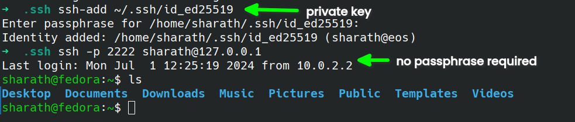

## SSH course

#### auth log location:

``` shell
cd /var/log/
```
now everything is in systemd so follow this command for logs:

``` shell
journalctl -u sshd.service
```

#### make a config and login to servere

``` shell
cd ~/.ssh
touch config
```

insdie `config` file write this:

``` 
Host myVM
  Hostname 127.0.0.1
  Port 2222
  User sharath
```

please note that, if you have multiple hosts, copy paste the above code in the `same file` and modifying necessary information

##### how to login?

``` shell
ssh myVM
```


### using public and private keys:

.pub is public key 
no extension is a private key


#### next step: Long way
- copy content of `id_rsa.pub`
- connect to remote server
- if there is no `.ssh` folder create one:
``` shell
mkdir .ssh
```
- create file called `authorized_keys`
``` shell
touch authorized_keys
```
- paste whatever charecters inside `id_rsa.pub` in `authorized_keys`
- disconnect from the server
- connect back = **You will see the difference**


#### see what is happening during connection

``` shell
ssh -v myVM
```

#### next step: easy way

``` shell
ssh-copy-id -i ~/.ssh/id_rsa.pub user@ipAddressOfServer
```

-i : input file

### Managing SSH keys

adding passphrase is annoying


#### ssh agent to cache the key in memory, so that we can use passphrase only one time

check ssh agent running or not: 

``` shell
ps aux | grep ssh-agent
```

then do this:

``` shell
eval "$(ssh-agent)"
```

again run this command to see the output:

``` shell
ps aux | grep ssh-agent
```

then run this command:

``` shell
ssh-add ~/.ssh/id_ed25519
```

then login to server:



### Configuring openSSH

configuring server component

- login to server

``` shell
which sshd
```

check status of sshd

``` shell
systemctl status sshd.service
```

above output must be in running status, if not something went wrong

to restart:

``` shell
sudo systemctl restart sshd.service
```

to stop (do not run for now)

``` shell
sudo systemctl stop sshd.service
```

if you stop the service, you will still be connected for now, only if you disconnect from the server then you are unable to connect to server because of above line of code


### to follow log file or Live View of Log files

``` shell
journalctl -fu sshd.service 
```


